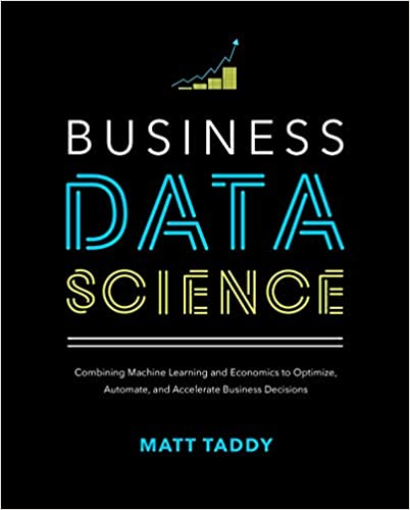
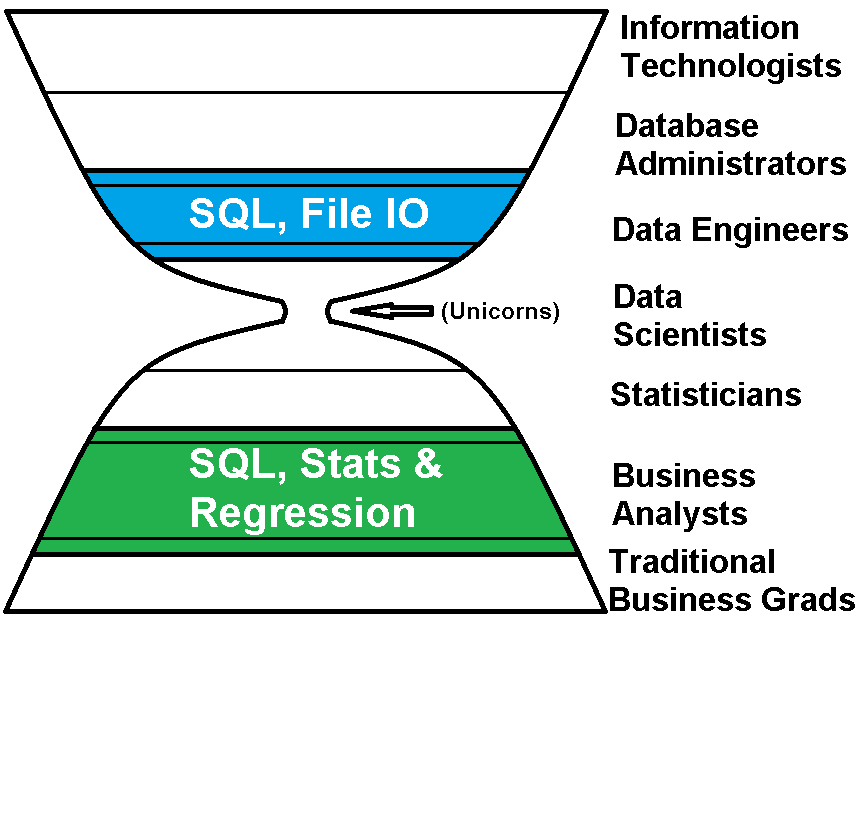

# ECP3004S21

ECP3004: Python for Business Analytics

## Course Description

The objective of this course is to teach you to solve quantitative problems using the Python programming language. It is designed for students interested in pursuing a career in business analytics. You will learn how to design computer programs that read data, manipulate data, perform calculations with data and apply these to problems in business analytics. 

## Learning Objectives

After completing this course, the student is expected to be able to: 
-	understand the types of data in Python and the corresponding operations,
-	use Python modules to solve problems,
-	write new functions and modules,
-	understand and implement calculations using linear algebra,
-	prepare and analyze data to solve a business problem and
-	understand how numerical calculations on the computer differ from written calculations.

## Enrollment Requirements

The formal requirements include QMB 3003 and QMB 3200, Quantitative Business Tools I and II. 
The true requirement, however, is a quantitative mindset. Computer programming is a quantitative exercise and is suitable for those with an interest in quantitative problem solving. 

## Required Textbooks

*Practical Programming: An Introduction to Computer Science Using Python 3.6, 3rd Edition* by Paul Gries, Jennifer Campbell, Jason Montojo. The Pragmatic Bookshelf: Raleigh, NC, 2017 (ISBN-13: 978-1680502688, ISBN-10: 1680502689).

*Business Data Science: Combining Machine Learning and Economics to Optimize, Automate, and Accelerate Business Decisions, 1st Edition* by Matt Taddy. McGraw-Hill: New York, NY, 2019 (ISBN-13: 978-1260452778 ISBN-10: 1260452778)

*Practical Programming* is the main text for the course. We will progress through the chapters of that book in a nearly linear fashion. The textbook *Business Data Science* will be used as a source of examples of business problems and data that are used in applications of business analytics. Even though these examples are written in the statistical programming language R, the calculations can be performed in Python with the skills learned in Practical Programming.

## Software

The primary tool for this course is software of the following kinds. 

*A Python distribution:*  All programming in this course will be carried out in the 
[Python](https://www.python.org/) 
programming language. It is free, open-source software that can be downloaded from the Internet. We will use Python version 3.6. Note that Python versions 2.X will not be compatible with all of the course activities.

*An Interactive Development Environment (IDE):* This is software for writing and running commands and scripts in the Python programming language. We will use [Spyder](https://www.spyder-ide.org/), 
which is available with the
[Anaconda](https://www.anaconda.com/products/individual) 
distribution of Python. 

*Version control software:* We will use the 
[GitHub](https://github.com/) 
repository to share course materials. This will be the primary medium for distributing materials for course demonstrations and it offers a convenient way to obtain feedback on coding assignments. 

## After This Course

What can you do with the skills you learn in this course? 
There are quite a few options to apply Python programming to 
business problems. 
The landscape of business analytics roles can be
classified according to the following taxonomy of positions. 

The hourglass shape indicates the relative proportions of performers in each role
(and, in fact, understates the proportions to a large degree). 
Although many of you would like to attain a position with a prestigious job title, 
there is plenty of work out there in some of the less glamorous jobs that need to be done, with some job titles you haven't heard of. 

Many of the positions available to students of this course can apply the skills to two main areas. 
One is to use SQL and File IO skills to organize data for measuring business success
and for statistical modeling. 
This is more closely related to the administration of databases and the "Data Engineering" role. 
They keep the plumbing working, so to speak, keeping the data flowing through the pipes.

On the other side, closer to the business operation, 
many analysts use data to answer business questions and to make decisions. 
These roles can be broadly labeled as "Business Analyst" but often have titles
relating to a particular business function, such as marketing or operations. 
These analysts are typically the consumers of the database
and organize data for statistical modeling to answer business questions
and monitor business performance. 

As a junior job-seeker, fresh out of college, 
your goal is to find a position *somewhere* on this landscape
and then your on-the-job performance record
will open the doors to the next position. 
