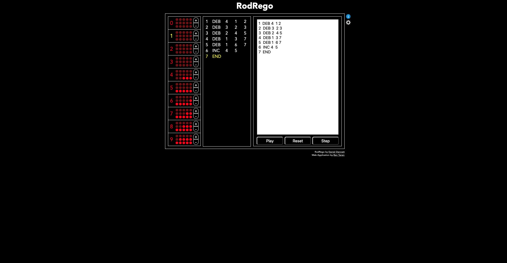

# Assignment 1


## Question 1

### Initialized Values of Registers:

An image will be displayed below, provided that an image is saved 
in this folder with the name ```ADD_1_2_3_init.png``` 
(with the filename spelled *exactly* as written). 


### Ending Values of Registers:

An image will be displayed below, provided that an image is saved 
in this folder with the name ```ADD_1_2_3_end.png``` 
(with the filename spelled *exactly* as written). 


## Question 2: Case that Succeeded

### Initialized Values of Registers:

An image will be displayed below, provided that an image is saved 
in this folder with the name ```SUB_1_2_4_init_success.png``` 
(with the filename spelled *exactly* as written). 


### Ending Values of Registers:

An image will be displayed below, provided that an image is saved 
in this folder with the name ```SUB_1_2_4_end_success.png``` 
(with the filename spelled *exactly* as written). 





## Question 2: Case that Failed

### Initialized Values of Registers:

An image will be displayed below, provided that an image is saved 
in this folder with the name ```SUB_1_2_4_init_fail.png``` 
(with the filename spelled *exactly* as written). 


### Ending Values of Registers:

An image will be displayed below, provided that an image is saved 
in this folder with the name ```SUB_1_2_4_end_fail.png``` 
(with the filename spelled *exactly* as written). 


If 6 images are displayed above, your assignment is complete. Congratulations!


## Modifications to ```SUB_1_2_4.txt```

You will notice that the program fails when the initial value in
register 2 is higher than the initial value in register 1. 
In that case, the program stops when we run out of values in register 1, 
leaving the incorrect value of zero in register 4.

### Correcting this Failure

You will have to add extra lines to add back one unit to register 2
(it subtracted one too many) and
copy the value to register 4.

That would still not be correct, however, because
the positive value of the difference is still not the correct answer.
We need to record a minus sign, so we can do this by using register 3.
When register 3 has value zero, it indicates the difference is positive. 
When register 3 has value one, it indicates the difference is negative. 


The modified program is in the file ```SUB_1_2_3_4.txt```.
Run it to test for yourself.


## Notes on Submission of Assignments

1. As a collaborator to your repository, I can view your submissions and that is where I will look to grade your assignments.
1. I can modify your submission to add comments or make minor corrections to improve the display.
1. It is better if I do not have to make such adjustments. 
You can help by following these practices:

- Save your work in your own private repository, instead of a fork of my repository (although that was acceptable this time).
- Save your work in a folder called (exactly!) ```assignment_0X```, 
where ```X``` is the number of the assignment. 
Note the underscore, the zero and the lower-case ```a```. 
This will be more important in future assignments, as I will run your programs and this will only work if they are named and located as required. 
- Make sure to name your files *exactly* as specified. 
- For example, some of you use a convention ```FINALSUBMISSION_required_name_of_file.py``` for the program that was required to be called ```required_name_of_file.py```. 
If you want to keep previous versions, you might instead follow the habit of naming your final submission ```required_name_of_file.py``` and save any previous work as ```PRELIMINARY_VERSION_required_name_of_file.py```.
- An easy way to do this is to begin working on your assignments 
by copying the folder ```assignment_0X``` and its contents 
from the course repository to your private repository. 
- To grade your assignment, I will run the program called
```required_name_of_file.py``` in the folder ```assignment_0X```.


