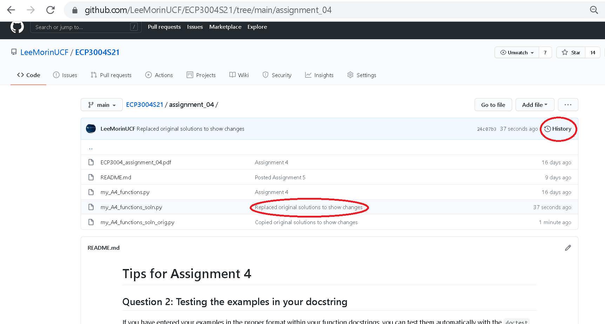
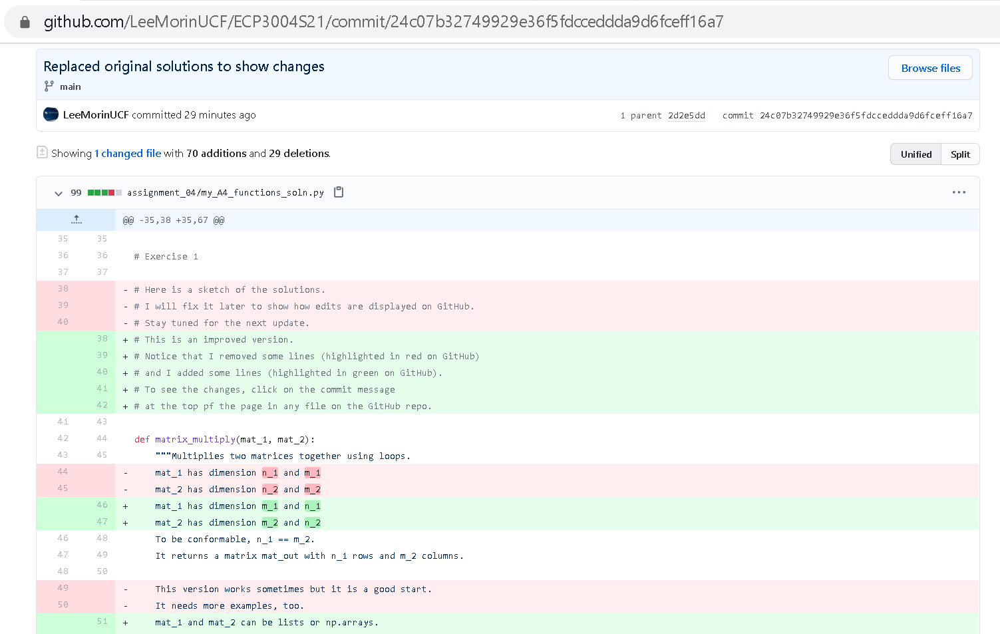

# Tips for Assignment 4


## Question 2: Testing the examples in your docstring

If you have entered your examples in the proper format within your function docstrings, 
you can test them automatically with the ```doctest``` module. 

```python
import doctest

doctest.testmod()
```

It should print out tests of the examples in your docstring, 
including a message about whether the tests passed or failed. 

Don't worry about test cases that fail in the smaller decimal points.
It is fine as long as your answer is accurate to several decimals. 


## Finding Good Test Cases

Good test cases have two main characteristics:
- They are easy to calculate.
- They detect potential errors.

These are some tips to choose simple examples that find errors: 
- A list of length three or four might be enough
- Choose values that evaluate to integers. 
For example, with your ```ssr``` functions, 
choose numbers such that ```y - beta_0 - x*beta_1``` are all integers. 
- For linear regression, choose one example that is perfectly linear. 
That is, choose any ```beta_0```, ```beta_1``` and ```x``` 
and calculate ```y = beta_0 + x*beta_1``` so that the linear equation holds exactly.
- Make sure to choose other examples that do not fit exactly on a line. 
An easy type of error is symmetric has four elements ```error = [1, -1, -1, 1]```.
Use it to calculate an example with ```y``` 
using ```y = beta_0 + x*beta_1 + error```.
- For functions that involve the log or exponential, choose values of 
```beta_0```, ```beta_1``` and ```x``` such that they add up to ```math.log(z)``` for some number ```z``` because ```math.exp(math.log(z)) = z```. 
Search online for exponentials and logarithms for a review. 
- Find some other way of calculating the function, such as with a calculator or a spreadsheet. Your python version will scale to much larger datasets but should work if it calculates correctly for even a pair of small lists. 


## Test Your Full Script

- After you finish a function, test it with your examples. 
- After you finish all the functions, test them all together with ```doctest```. 
- When they are all finished, run the entire script from top to bottom. 
Press ```F5``` or the green "Play" button with the green triangle.
- If there are any errors, find where they are by running small sections until you isolate the error. 
- The error message gives clues about the problem and ```^``` points to the location of the error. Online help becomes more useful as you gain experience. 
- Shut down Spyder and reopen it to test your full script one more time, 
starting fresh with nothing else in memory. 
Sometimes previous calculations make your functions work temporarily 
but the script fails when run from an empty workspace. 

It's important that your script runs without errors because it stops running once it hits the first error and all the rest of the functions will not be defined
and the examples will fail. 


## How to View Corrections to Your Script

One of the main features of GitHub is that it keeps track
of different versions of your code. 
That is why it is called *version control software*. 
It also provides a nice way to view a line-by-line comparison of changes between successive versions. 

You can see the changes I made to different versions of the solutions to Assignment 4. 
Go to a location in your repo and click on the commit message beside a particular file to see the changes in that file. 
Here, you would click the message 
"Replaced original solutions to show changes". 
You can also access the history of all previous changes, 
labeled by the GitHub user who made those changes by pressing "History". 




To view the last change to ```my_A4_functions_soln.py```, 
click the message 
"Replaced original solutions to show changes". 
You will see the following display:




The lines that were removed are highlighted in red 
and the lines that were added are highlighted in green. 
I added some comments and modified some parts of the functions
to make the function more robust. 
I also copied the original version to the file 
```my_A4_functions_soln_orig.py``` 
for comparison. 

Click on the commit message 
"Solutions and testing scripts for Assignment 4"
in your GitHub repo to see the corrections I made to your 
```my_A4_functions.py``` script.

As with Assignment 3, you will see two versions of the output of your script when I run it. 
The first I called ```my_A4_functions_out_LM.txt``` 
(with my initials, in case you used the same filename for your examples) was created by running your script as it was submitted. 
After making adjustments to your ```my_A4_functions.py``` script, 
I output the results to ```my_A4_functions_adj_out_LM.txt```. 
You can compare the differences in the outputs 
with the changes visible when you click the commit message 
"Solutions and testing scripts for Assignment 4". 

Note that there may still be several error messages because 
I tested a number of versions of the formats of the inputs, 
to see if your script worked for *some* version 
but it didn't have to work for all versions. 
