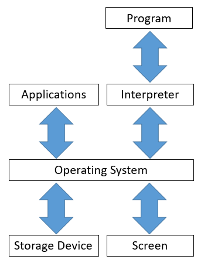
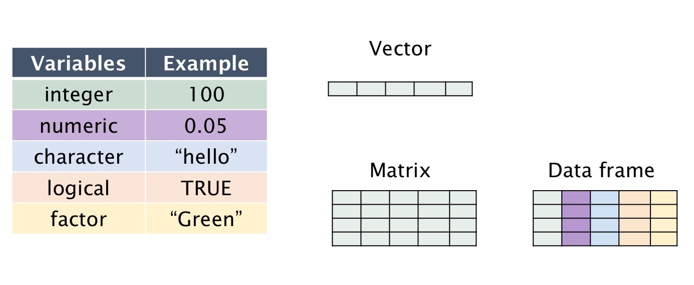
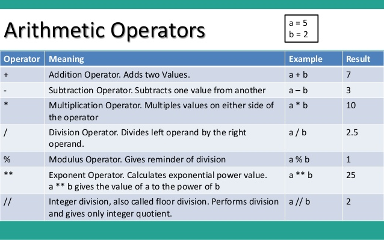

# ```"Hello, Python"```


Python is a language of choice for data science and business analytics. 
It is an interpreted, high-level and general-purpose computer programming language. 
We define all of these terms in what follows. 


## What is a computer?

At a basic level, a *computer* is a list of *information stored in memory*, combined with some *operations* that can be performed on the information in memory.
At any time, a computer has a state that is defined by the set of values at each of the locations in memory.


## What is a program?

A *computer program* is a *list of instructions* for operations to be performed on the values stored in memory.
A program alters the state of the computer.


## How do computers run programs?

The human-readable computer program that you write is *interpreted*, or translated into another set of instructions, by another program called the interpreter.
This interpreter translates the program into something that will run on the operating system.
The operating system, such as Windows, Linux or Mac OS, is another set of programs that then translate your instructions into a more primitive set of instructions that are finally executed on the computer.



Why go through all of this trouble? Well, first, the operating system uncouples your program from the particulars of the hardware on your physical computer, such as the monitor, the hard drive and the keyboard.
Further, the interpreter separates the instructions in your program from the particular operating system on your computer.
With this separation, you need only write the instructions in standardized syntax and the interpreter and operating system take care of the rest.

To say that python is a *high-level language* is to say that there are several levels of interpretation between the python script that you type and the operations that are actually run on the computer. 
This form of computing is often slower to run but faster to code. 
In comparison, languages such as C++ or Fortran are low-level languages that are slower to code, must be compiled before running, instead of interpreted as they run, but run much faster. 
Python is known to have a flatter learning curve that these low-level languages but, as a general-purpose language, the learning curve is steeper than that for languages such as R, which are designed for specific purposes. 


## How do *you* run programs on computers?

### Programming *Languages*

Computer programming languages are, literally, languages. 
It is not a metaphor to call tem languages.
In Google, a language is defined as "the method of human communication, either spoken or written, consisting of the use of words in a structured and conventional way."
A computer programming language is a written method of communication to communicate instructions to a computer. 
Like other languages, programming languages have parts of speech, syntax and punctuation. 


### Nouns: The Objects You Can Work With

The nouns of programming languages are the variables or objects that take on particular values in memory. 
Variables are stored in various *types* or *classes*. 
Data types are often numeric, such as integers or real numbers. 
Depending on the particular language, these types are sometimes called "float" or "long" or "double", depending on the degree of precision, as in the number of decimal places or significant digits.  
There are also data types for holding non-numeric data, such as letters of the alphabet, in variables called *strings* or *character* vectors. 


Examples of *types* of data are as follows: 



A variable can have a single element (i.e. atomic) or be a vector or array of values. 
Typically, vectors and arrays comprise elements of the same data type. 
For statistical programming, languages such as ```R``` and ```Python``` also allow for the collection of data into data frames, in which each column can be of a separate data type. 


We have many objects to work with. 
Now, what can we do with them?


### Verbs: The Actions You Can Perform

The action words of programming are sorted into several categories. 
The first we will consider should be familiar to you. 


### Arithmetic operators

These are the operators that are most familiar to you. 


In ```python``` these operators are used



These operators can be combined with brackets for calculations performed following the usual order of operations in arithmetic. 
Although useful on their own, these operators are often combined to perform a specific calculation within a function. 


# *Practical Programming*, Chapter 2: ```"Hello, Python"```

## Expressions and Values: Arithmetic in Python


Python does arithmetic as you expect. For example:

```python 
>>> 4 + 13
17

``` 

Other operations work similarly:

```python 
>>> 15 - 3
12
>>> 4 * 7
28

``` 

Division produces numbers with decimals, called ```floats```,

```python 
>>> 5 / 2
2.5

``` 

even if the result is a whole number (called an integer or ```int```)

```python 
>>> 4 / 2
2.0

``` 


### Types

An expression involving two floats produces a float

```python 
>>> 17.0 - 10.0
7.0

``` 

Python typically uses the most general data type, 
such as a float, even when one operand is an integer. 

```python 
>>> 17.0 - 10
7.0
>>> 17 - 10.0
7.0

``` 

The dot is enough to identify a number as a float, 
even if there are no decimals specified.

```python 
>>> 17 - 10.
7.0
>>> 17. - 10
7.0

``` 

Some programmers think this is bad form, since a single dot
could easily be missed, but python is built with many such shortcuts. 


### Integer Division, Modulo, and Exponentiation

Two forward-slashes denote *integer division*, 
which ignores the decimal remainder. 

```python 
>>> 53 // 24
2

``` 

The remainder is calculated with the *modulo* operator. 

```python 
>>> 53 % 24
5

``` 

Python doesn't round with integer division; it takes the ```floor```

```python 
>>> 17 // 10
1

``` 

If the number is negative, the floor is still one number lower:

```python 
>>> -17 // 10
-2
``` 

When a sign is negative, the sign of the modulo output is 
the sign of the divisor (the second operand).

```python 
>>> -17 % 10
3
>>> 17 % -10
-3
``` 

These operators work with floats, as well, 
except the result is still rounded to the nearest whole number.

```python 
>>> 3.3 // 1
3.0
>>> 3 // 1.0
3.0
>>> 3 // 1.1
2.0
>>> 3.5 // 1.1
3.0
>>> 3.5 // 1.3
2.0

``` 
A double asterisk calculates an exponent

```python 
>>> 3 ** 6
729

``` 

The above examples, with two operands, apply *binary operators*.
Negation is a *unary operator* because it applies to one operand. 


```python 
>>> -5
-5
>>> --5
5
>>> ---5
-5

``` 

It works exactly as you would expect if you repeatedly multiplied
a number by negative 1. 


## What *Is* a Type?

A type is a set of values, combined with a set of operations on those values. 
In the above examples, the set of values are ```int``` or ```float```, 
combined with the arithmetic operators. 


### Finite Precision

Computers can calculate only a limited set of values, as
numbers are held to only so many decimal places:

```python 
>>> 2 / 3
0.6666666666666666
>>> 5 / 3
1.6666666666666667

``` 

Sometimes the calculations that would be equivalent on paper
turn out to have small differences in variables with finite precision. 

```python 
>>> 2 / 3 + 1
1.6666666666666665
>>> 5 / 3
1.6666666666666667

``` 

The size of the operands makes a difference as well, 
especially when combining two numbers of very different magnitude.


```python 
>>> 10000000000 + 0.00000000001
10000000000.0

``` 

### Operator Precedence

Convert temperature from Fahrenheit to Celsius:

```python 
>>> 212 - 32 * 5 / 9
194.22222222222223

``` 

Is that correct? No, because the order of operations
dictate that the multiplication and division be completed first. 
Use parentheses to force the priority of operations over *subexpressions*. 

```python 
>>> (212 - 32) * 5 / 9
100.0
``` 

Oerators with hiher precedence are evaluated before those with lower precedence. 


```python 
>>> -2 ** 4
-16
>>> -(2 ** 4)
-16
>>> (-2) ** 4
16

``` 

Exponentiation has higher precedence than negation.


## Variables and Computer Memory: Remembering Values

The *assignment operator*, ```=```, assigns a value to be stored
in a particular location in memory:

```python 
>>> degrees_celsius = 26.0

``` 

The variable *degrees_celsius* can be though of as the *address*
to that location in memory. 
Once it is assigned, it can be used in subsequent calculations. 

```python 
>>> degrees_celsius = 26.0
>>> degrees_celsius
26.0
>>> 9 / 5 * degrees_celsius + 32
78.80000000000001
>>> degrees_celsius / degrees_celsius
1.0

``` 

```python 
>>> degrees_celsius = 26.0
>>> 9 / 5 * degrees_celsius + 32
78.80000000000001
>>> degrees_celsius = 0.0
>>> 9 / 5 * degrees_celsius + 32
32.0

``` 
New variables can be assigned values from operations involving
the other variables in memory. 

```python 
>>> degrees_celsius = 15.5
>>> difference = 100 - degrees_celsius
>>> difference
84.5
``` 


### Values, Variables and Computer Memory

How does the computer perform these calculations? 
It performs the calcualtions one-at-a-time, in order of precedence,
and stores the intermediate calculations in temporary
locations in memory.

```python 
>>> degrees_celsius = 26.0 + 5
>>> degrees_celsius
31.0

``` 
The ```26.0 + 5``` expression must be evaluated first, and stored somewhere, 
before it is assigned to the variable ```degrees_celsius```,
and similarly for ```2 * difference``` in the following.

```python 
>>> difference = 20
>>> double = 2 * difference
>>> double
40
>>> difference = 5
>>> double
40

``` 
Notice that the later change to ```difference```
did not change the value of ```double```.


### Augmented Assignment

You can update the value of a variable using the operations above:

```python 
>>> score = 50
>>> score
50
>>> score = score + 20
>>> score
70
``` 

The shorthand notation ```+=``` performs both the addition 
and the reassignment in one operator. 

```python 
>>> score = 50
>>> score
50
>>> score += 20
>>> score
70

``` 
It works similarly for multiplication.

```python 
>>> d = 2
>>> d *= 3 + 4
>>> d
14

``` 
These two operations produce the same output:

```python 
>>> number = 10
>>> number *= number
>>> number
100

``` 

```python 
>>> number = 10
>>> number = number * number
>>> number
100

``` 

You can repeat these operations to create a sequence of values

```python 
>>> number = 3
>>> number
3
>>> number = 2 * number
>>> number
6
>>> number = number * number
>>> number
36

``` 

## How Python Tells You Something Went Wrong

Troubleshooting, called *debugging*, is a big part of programming. 
Over time, you will gain experience deciphering error messages
and finding *bugs*. 
Some are self explanatory: 

```python 
>>> 3 + moogah
Traceback (most recent call last):
  File "<stdin>", line 1, in <module>
NameError: name 'moogah' is not defined

``` 
For this command to work, there would have to be a variable
named ```moogah``` in memory, i.e. defined before this calculation. 

Binary operators require two operands:

```python 
>>> 2 +
  File "<stdin>", line 1
    2 +
      ^
SyntaxError: invalid syntax

``` 
otherwise the syntax is invalid. 

Some values are protected. 
For example, numbers cannot be assigned new values. 

```python 
>>> 12 = x
  File "<stdin>", line 1
SyntaxError: can't assign to literal

``` 


## A Single Statement That Spans Multiple Lines

The backslash operator will allow a single command to extend to the next line. 

```python
>>> 2 + \
... 3
5
``` 
Sometimes, you can use rewrite the expression, so that it is clear
that the expression extends to the next line. 

```python 
>>> (2 +
... 3)
5
```

How to translate pre-heating time from Fahrenheit (in the cookbook)
to Celsius (on the oven controls):

```python 
>>> room_temperature_c = 20
>>> cooking_temperature_f = 350
>>> oven_heating_rate_c = 20
>>> oven_heating_time = (
... ((cooking_temperature_f - 32) * 5 / 9) - room_temperature_c) / \
... oven_heating_rate_c
>>> oven_heating_time
7.833333333333333

``` 

We can use whitespace to make it clearer:

```python 
>>> oven_heating_time = (
...     ((cooking_temperature_f - 32) * 5 / 9) - room_temperature_c) / \
...     oven_heating_rate_c
``` 

We can also spread the calculation out over several lines 
to make each part more clear.

```python 
>>> oven_heating_time = (
...     ((cooking_temperature_f - 32) * 5 / 9) -
...      room_temperature_c) / \
...     oven_heating_rate_c

``` 

We could also change the order of calculations
to perform intermediate calculations separately. 

```python 
>>> room_temperature_c = 20
>>> cooking_temperature_f = 350
>>> cooking_temperature_c = (cooking_temperature_f - 32) * 5 / 9
>>> oven_heating_rate_c = 20
>>> oven_heating_time = (cooking_temperature_c - room_temperature_c) / \
...     oven_heating_rate_c
>>> oven_heating_time
7.833333333333333

``` 

Coders differ in terms of their preferred style. 
Some like to play *code golf* by performing a calculation in 
the minimum number of lines. 
That's fine, for an expert, but a beginner should separate 
calculations to simplify the coding (and debugging). 

In fact, a good way to produce reliable programs is to 
separate the calculation into small parts that are easy to code 
and to test--then you might not have to do any debugging.


## Describing Code

Help a human understand your program by using the ```#``` character. 
Python ignores anything in a line after the ```#``` character
(and the entire line if it begins with ```#```).


```python 
>>> # Python ignores this sentence because of the # symbol.

``` 
A future user that understands what is going on will be happier
to use your program. 
Sometimes the future user is *future you*.


