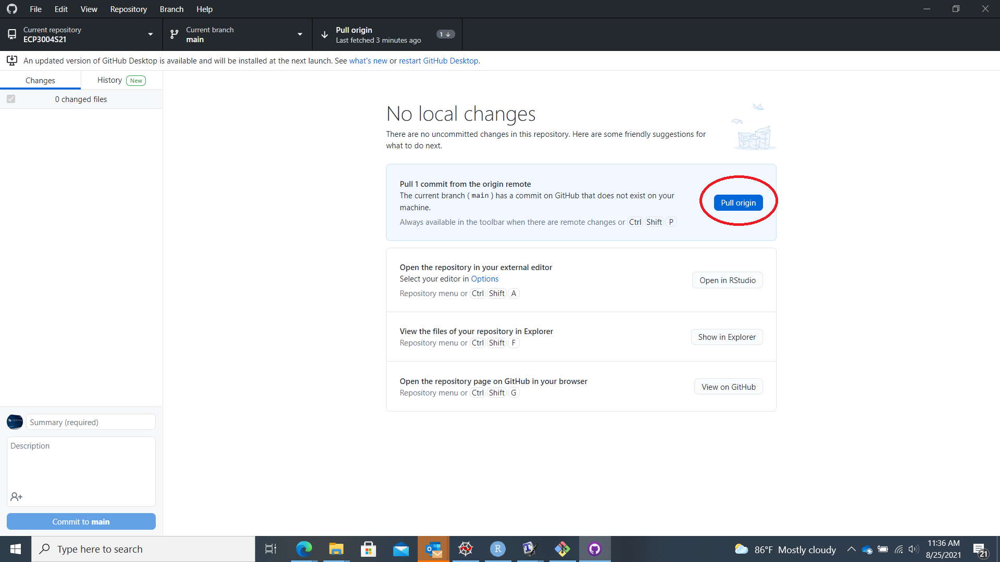

# GitHub Desktop


GitHub is an online repository for storing software. 
It is a safe location where you save successive versions of your code
so that past versions of your code can be recovered,
should you need to make corrections or replace your computer.
This is why it is called *version control software*. 
It is also useful to collaborate on software because multiple
software developers will be able to modify the same online repository.

The repository for this course can be viewed in a browser. 


## How to Update your Repo

To complete and submit your assignments, you will want to 
```commit``` and ```push``` changes to the repository, 
after making those changes in the corresponding files 
on your local computer.

### Open GitHub Desktop

GitHub Desktop software allows you to manage changes. 
Open this program ...


... and you should see a screen matching the examples below.
You will have to enter your GitHub login credentials
and approve your own access to the site through this particular computer. 


### Cloning a Repository

Once GitHub is open, the first step is *cloning* your repository. 
This makes a copy of the online repository and places it 
in a folder on your computer. 
Click on ```File -> Clone repository...```.


Select the repository you wish to clone.


Then press ```Clone```.


Now you should have a local copy of the repository
on the file system on your computer. 
It will be stored in a folder with the same name as the 
repository, e.g. ```ECP3004S21```, in a folder called ```GitHub```.

### Making Changes

Making changes is fairly straightforward. 
You simply create or delete files or make changes to them, 
within the local folder. 
Basically, you do the work you set out to do, 
as if there were no repository. 
That's the beauty of GitHub: you just do your work
and your work gets archived periodically with a few clicks 
of a button. 

In this example, I have added a file. 
As an example, it is an image of the course banner
"Python for Business Analytics".


Following a requirement for Assignment 1, 
I rename it to a specific filename so that it will be displayed 
on the screen in the folder ```assignment_01```. 


You should now see a description of the changes made, 
including an image, in this case. 

### Committing Your Changes

The next step is to ```commit``` your changes. 
This collects any changes that you have made into a 
package of changes. 
Typically, you will collect similar changes in one commit, 
e.g. the solution to Assignment 1, Question 1. 
You type a description of the changes to inform other users, 
which could include *future you*, 
about the nature of the changes and the problem solved. 


After the changes are committed, you can push this bundle of 
changes to your online repository. 


After the changes are pushed, your local repository, 
on your computer, should have the same contents as the remote
repository, the version online. 


### Verifying the Changes

It is often a good idea to verify that the changes have been made
according to your expectations. 
Open your browser to the repository on ```github.com``` 
to see the folder you updated. 


If you are already on that Webpage, you will need to refresh the Webpage. 
You should now see that the change has been made. 
In this case, we have uploaded an image;
in Assignment 1, 
you will upload images of the states of the Rodrego program
to document the operation of the register machine. 


If you notice you have made an error, simply make the change
on your local computer and ```commit``` and ```push``` again. 
Most of the work in computer programming is about
making, detecting, and correcting errors, and GitHub is a useful
tool designed to keep track of all your changes over time. 

### Pulling Changes

Often, there may be changes made to the repo that have not been made
on your local machine. 
This will occur if other programmers are contributing to the repo
or if you made contributions from another computer. 
You can *pull* changes from the remote repository to get your 
local copy up-to-date with the remote repository. 




After pressing the "Pull" button, 
you should see that the updates have been made to your local folder.
You can check for the new files or updated "Last Modified" dates
in an application such as "File Explorer" in Windows. 

