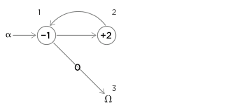
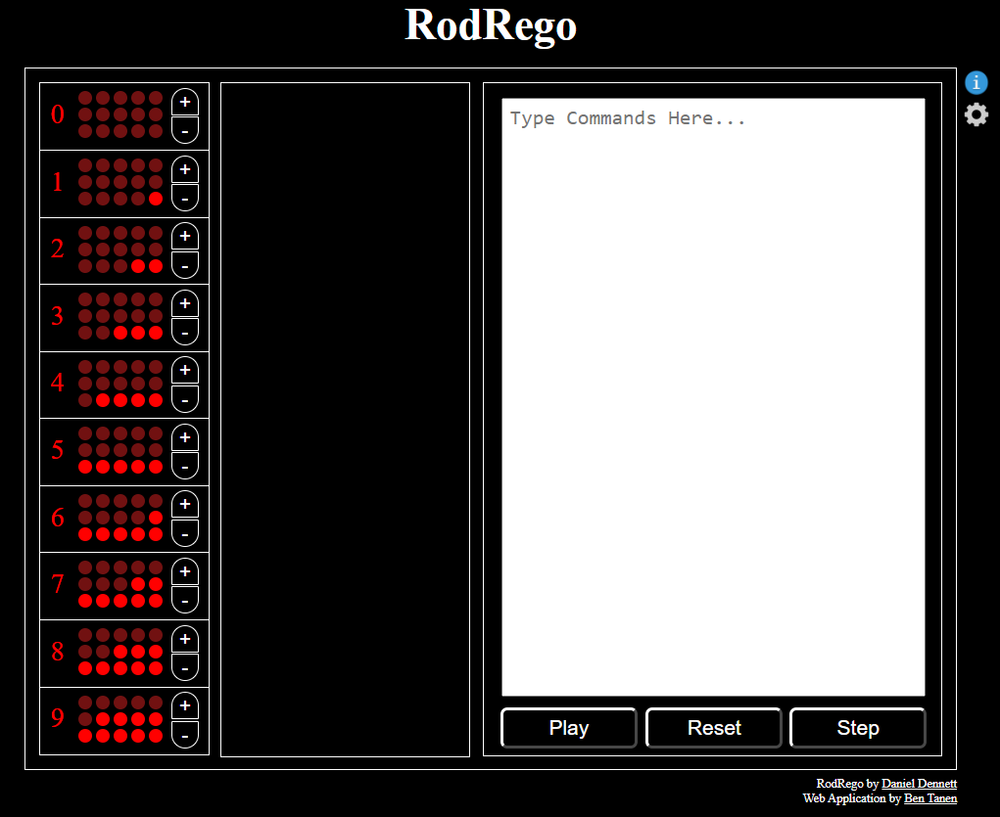
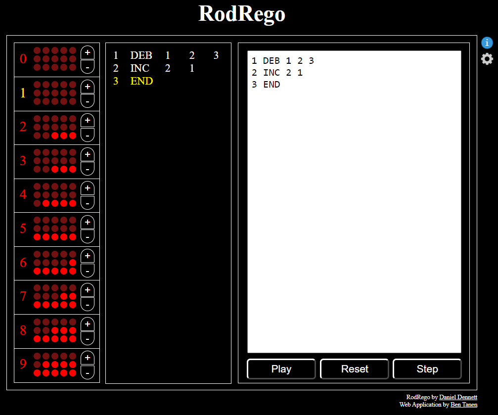
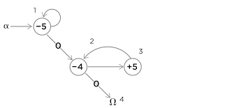
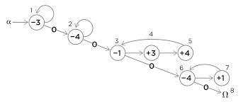
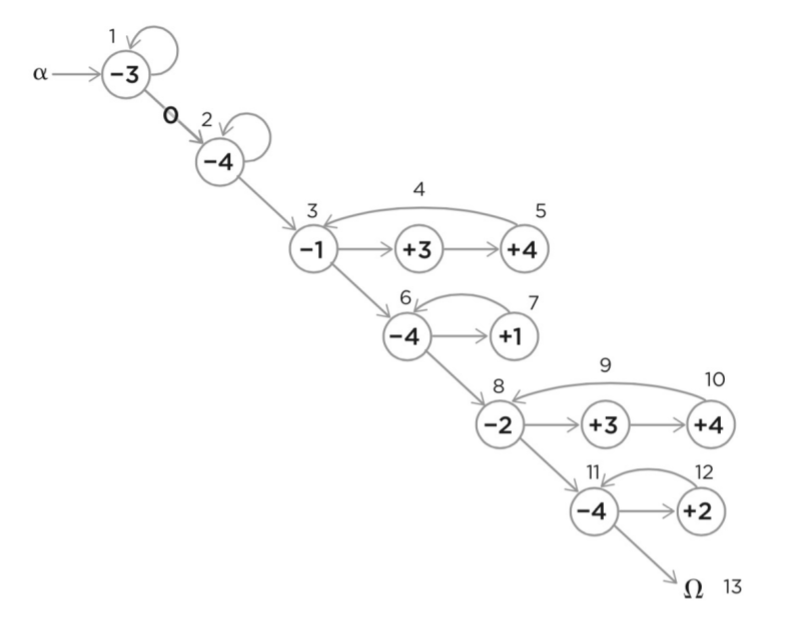

# Chapter 3, Part A: Using Functions

## Functions That Python Provides

Some functions are *built-in*

```python 
>>> abs(-9)
9
>>> abs(3.3)
3.3
``` 

A *function call* is of the form
```function_name(argument_1, argument_2, argument_3, ...)```.
Arguments can be any value stored in memory. 
That is, any variable or value that is defined before the function call. 


```python 
>>> day_temperature = 10
>>> night_temperature = 3
>>> abs(day_temperature - night_temperature)
7
>>> day_temperature = 3
>>> night_temperature = 10
>>> abs(day_temperature - night_temperature)
7

``` 
You can combine the outputs of functions as operands in
arithmetic operators: 
```python 
>>> abs(-7) + abs(3.3)
10.3
``` 


```python 
>>> 3 + 5 / abs(-2)
5.5

``` 
or as arguments in other operators

```python 
>>> pow(abs(-2), round(4.3))
16

``` 

Some functions convert from one type to another

```python 
>>> int(34.6)
34
>>> int(-4.3)
-4
>>> float(21)
21.0

``` 
The ```help``` function will show documentation for a function.

```python 
>>> help(abs)
Help on built-in function abs in module builtins:

abs(x, /)
    Return the absolute value of the argument.

``` 
The ```round``` function also converts a floating-point number 
into an integer:

```python 
>>> round(3.8)
4
>>> round(3.3)
3
>>> round(3.5)
4
>>> round(-3.3)
-3
>>> round(-3.5)
-4

``` 
but it can also be used to convert to a float with fewer significant digits.

```python 
>>> round(3.141592653, 2)
3.14

``` 


```python 
>>> help(round)
Help on built-in function round in module builtins:

round(...)
    round(number[, ndigits]) -> number

    Round a number to a given precision in decimal digits (default 0 digits).
    This returns an int when called with one argument, otherwise the
    same type as the number. ndigits may be negative.

``` 
There is more than one way to calculate exponents. 

```python 
>>> help(pow)
Help on built-in function pow in module builtins:

pow(x, y, z=None, /)
    Equivalent to x**y (with two arguments) or x**y % z (with three arguments)

    Some types, such as ints, are able to use a more efficient algorithm when
    invoked using the three argument form.

``` 
If you pass only two arguments, it takes the empty value ```None``` by default.

```python 
>>> pow(2, 4)
16
``` 
If the third argument is provided, it performs the additional calculation. 

```python 
>>> pow(2, 4, 3)
1
``` 


## Memory Addresses: How Python Keeps Track of Values

The name of each variable corresponds to a location in memory.
The ```id``` function returns an integer that identifies that location in memory.

```python 
>>> help(id)
Help on built-in function id in module builtins:

id(obj, /)
    Return the identity of an object.

    This is guaranteed to be unique among simultaneously existing objects.
    (CPython uses the object's memory address.)

``` 

Some values are already stored in memory.

```python 
>>> id(-9)
4301189552
>>> id(23.1)
4298223160
```

Other variables that you create are immediately assiggned to locations in memory.
```python
>>> shoe_size = 8.5
>>> id(shoe_size)
4298223112
>>> fahrenheit = 77.7
>>> id(fahrenheit)
4298223064

``` 
Even functions are objects in memory and are assiggned to locations in memory. 
```python 
>>> id(abs)
4297868712
>>> id(round)
4297871160

``` 

### Python Remembers and Reuses Some Objects

Python stores some very common numbers in special places in memory
and reuses these locations as needed. 
```python 
>>> i = 3
>>> j = 3
>>> k = 4 - 1
>>> id(i)
4296861792
>>> id(j)
4296861792
>>> id(k)
4296861792

``` 
This is not the case for larger integers or floats. 
```python 
>>> i = 30000000000
>>> j = 30000000000
>>> id(i)
4301190928
>>> id(j)
4302234864
>>> f = 0.0
>>> g = 0.0
>>> id(f)
4298223040
>>> id(g)
4298223016

``` 


## Defining Our Own Functions

You might want to have a function that can convert temperature from
Fahrenheit to Celsius.
It should work as follows.

```python 
>>> convert_to_celsius(212)
100.0
>>> convert_to_celsius(78.8)
26.0
>>> convert_to_celsius(10.4)
-12.0

``` 
But if you run those function calls before the function is defined, 
Python throws an error:

```python 
>>> convert_to_celsius(212)
Traceback (most recent call last):
  File "<stdin>", line 1, in <module>
NameError: name 'convert_to_celsius' is not defined

``` 
So, you have to define the function. 
Function definitions take the following format:

```python 
>>> def convert_to_celsius(fahrenheit):
...     return (fahrenheit - 32) * 5 / 9
...

``` 
The indenting is important because that is how Python
knows when the function definition is complete. 

```python 
>>> def convert_to_celsius(fahrenheit):
... return (fahrenheit - 32) * 5 / 9
  File "<stdin>", line 2
    return (fahrenheit - 32) * 5 / 9
         ^
IndentationError: expected an indented block

``` 
After the function is defined, you can use it
just as you would for built-in functions. 

```python 
>>> def convert_to_celsius(fahrenheit):
...     return (fahrenheit - 32) * 5 / 9
... 
>>> convert_to_celsius(80)
26.666666666666668

``` 
When you use a function to calculate its output from the arguments, 
it is called *calling* the function.
Test it with a few values.

```python 
def convert_to_celsius(fahrenheit):
	return (fahrenheit - 32) * 5 / 9

convert_to_celsius(80)
convert_to_celsius(78.8)
convert_to_celsius(10.4)

``` 

Look for some documentation, just as you would for built-in finctions.

```python 
>>> help(convert_to_celsius)
Help on function convert_to_celsius in module __main__:

convert_to_celsius(fahrenheit)

``` 

There is no documentation. 
*You* made the function, *you* provide the documentation. 
You do that by including a docstring, a description
enclosed in triple quotes, which includes a written 
description and some examples. 

```python 
def convert_to_celsius(fahrenheit: float) -> float:
    """Return the number of Celsius degrees equivalent to fahrenheit
    degrees.

    >>> convert_to_celsius(75)
    23.88888888888889
    """

    return (fahrenheit - 32.0) * 5.0 / 9.0


convert_to_celsius(80)
convert_to_celsius(78.8)
convert_to_celsius(10.4)

``` 

Now try the ```help``` function again. 


### Keywords Are Words That Are Special to Python

Because the ```def``` keyword was used to define a function, 
it cannot be used as a variable. 

```python 
>>> def = 3
  File "<stdin>", line 1
    def = 3
        ^
SyntaxError: invalid syntax
```
The same applies to built-in function names that are already defined. 

```python
>>> def return(x):
  File "<stdin>", line 1
    def return(x):
             ^
SyntaxError: invalid syntax

``` 

But be careful: this does not apply to functions that *you* define. 
When you overwrite your own function, the original definition 
is discarded and replaced with the new function. 


## Using Local Variables for Temporary Storage

It often helps make code more clear when you use separate 
local variables for intermediate calculations. 
These are called *local* variables because they are only 
defined in the memory allocated within the function. 

```python 
>>> def quadratic(a, b, c, x):
...     first = a * x ** 2
...     second = b * x
...     third = c
...     return first + second + third
...
>>> quadratic(2, 3, 4, 0.5)
6.0
>>> quadratic(2, 3, 4, 1.5)
13.0

``` 

After you run the function, these variables 
no longer exist outside of the function. 

```python 
>>> quadratic(2, 3, 4, 1.3)
11.280000000000001
>>> first
Traceback (most recent call last):
  File "<stdin>", line 1, in <module>
NameError: name 'first' is not defined
```

Even the arguments are only defined within the function. 
```python
>>> a
Traceback (most recent call last):
  File "<stdin>", line 1, in <module>
NameError: name 'a' is not defined

``` 

These arguments, without a default value, must be provided, 
even if you assigned them a value in a previous function call. 
```python 
>>> quadratic(1, 2, 3)
Traceback (most recent call last):
  File "<stdin>", line 1, in <module>
TypeError: quadratic() takes exactly 4 arguments (3 given)

``` 
The more errors you see, the easier it will be for you to 
identify what the problem is and how to fix it. 

## Tracing Function Calls in the Memory Model

What do you think this function does?

```python 
>>> def f(x):
...     x = 2 * x
...     return x
...
>>> x = 1
>>> x = f(x + 1) + f(x + 2)
``` 

Python keeps track of all the intermediate calculations
in separate places in memory, one for each of the different ```x```'s above.

See the explanation in *Practical Programming* on pages 40-46.


## The Register Machine

A *register machine* is one of the simplest forms of computers.
It is useful to model the use of memory locations in performing calculations
on a computer. 
The register machine was introduced by a logician Hao Wang at the dawn of the computing age. 
It stores information in a list of registers, each one with a natural number. 
It can perform three operations:

* ```END``` will halt the program.
* ```INC``` will increase the number in a register by 1.
* ```DEB``` will decrease the number in a register by 1, if it is nonzero, otherwise ```BRANCH```.


Simple as they are, these operations are enough to do anything that any computer can do -- it just might take a long time.
The first command is not very interesting but it is still required to declare that the program has stopped. 
The second is fairly simple and makes a primitive change to the state of the register. 
The magic occurs with the third condition. 
Subtraction is nearly the same as addition, in reverse, except that it is undefined if the particular register has a value of zero. 
This is important because it provides an opportunity to execute a command that depends on the state of the register.

These commands are listed in a program in which each line has up to four parameters:

* The first is the *step* number of the program referring to a particular command.
* The second is the *instruction*, the command to either ```END```, ```INC``` or ```DEB```.
* The third is needed only in the case of the ```INC``` or ```DEB``` commands. After changing the register, it instructs the computer to *go to* a particular *step* in the program and execute the instruction at that step next. 
* The fourth column is ony needed for the ```DEB``` command. It indicates the *branch-to step* in the program to be executed next in the case that the register has a value of zero and cannot be decreased. 

Here are some examples that follow from the discussion of the [RodRego](http://sites.tufts.edu/rodrego/) program on the website of the philosopher Dan Dennet at Tufts University. 
RodRego is a program for running programs in a language called ```RAP```, which stands for *Register Assembly Programming*. 
A version that will run in your browser is available [here](http://proto.atech.tufts.edu/RodRego/).
The following examples are found in Dan Dennet's book *Intuition Pumps and Other Tools for Thinking*. 

### Program 1: ```ADD[1,2]```

This program adds the value in register 1 to the value in register 2.

```
1 DEB 1 2 3
2 INC 2 1
3 END
```

This process is illustrated in a *flow graph*. 
Each circle represents an instruction, with the number inside showing the *address* of the register to be changed, with a "+" for an ```INC``` instruction and a "-" for a ```DEB``` instruction. 
Only one arrow trails from the ```INC``` instruction but two arrows trail from the ```DEB``` instruction, with the *branch-to* step labeled with a zero. 
The program starts at &alpha; and ends at &Omega;.





Now run this program to see it in action. 
Open RodRego and it is initialized with ten registers, 
with *addresses* numbered zero to nine, each initialized with 
the *value* equal to the *address* of the register. 




Running the program above, results in the output below. 



You can also watch each change by running the program step-by-step. 
Notice that the value in register 1 is empty, while register 2 contains the sum. 
To preserve the value of the inputs, we will have to learn a few more tools. 
We can run the following programs in the RodRego program as above. 

### Program 2: ```MOVE[4,5]```

This program moves the contents of register 4 into register 5:

```
1 DEB 5 1 2
2 DEB 4 3 4
3 INC 5 2
4 END
```

The flow graph is shown here:




Notice the first step is to remove the contents of register 5 so that the value does not get counted with the value moved from register 4.

### Program 4: ```COPY[1,3]```

This program copies the value in register 1 and records it in register 3. 

```
1 DEB 3 1 2
2 DEB 4 2 3
3 DEB 1 4 6
4 INC 3 5
5 INC 4 3
6 DEB 4 7 8
7 INC 1 6
8 END
```





As above, thie first steps are to clear spaces in memory to store the result (in register 3) and store the values of intermediate calculations (in register 4). 
Steps 3, 4 and 5 cycle through the subtraction of values from register 1 and the addition of each value to both registers 3 and 4. 
Moving to register 3 is the goal but the movement to register 4 is to store the original value of register 1.
When register 1 is empty, the program then alternates between steps 6 and 7 to move the values in register 4 back to register 1, leaving the value that was copied in its original location. 


### Program 4: Non-destructive ```ADD[1,2,3]```

This program now adds the values in registers 1 and 2 and stores the result in register 3, while preserving the values in registers 1 and 2. 

```
1  DEB 3  1  2
2  DEB 4  2  3
3  DEB 1  4  6
4  INC 3  5
5  INC 4  3
6  DEB 4  7  8
7  INC 1  6
8  DEB 2  9 11
9  INC 3 10
10 INC 4  8
11 DEB 4 12 13
12 INC 2 11
13 END
```




Other programs can be written to multiply two values, with repeated addition. 
Subtraction can also be performed similarly, except that there is the potential for negative values, in which an extra register must be used to store a minus sign. 
Division can be completed by repeated subtraction, with an extra register for the remainder, with one additional hitch: storing an error message in a register to denote division by zero. 
Once these programs are written, one can create a program to emulate a pocket calculator by including a register with a value to indicate the desired operation. 
For example, zero for ```ADD```, one for ```SUBTRACT```, two for ```MULTIPLY``` and three for ```DIVIDE```. 

The extension to more advanced computers is described in this note: [Secrets to Computer Power Revealed](http://sites.tufts.edu/rodrego/files/2011/03/Secrets-of-Computer-Power-Revealed-2008.pdf) and an updated version is available in [this note from a Royal Institution Masterclass](http://brainmindforum.com/docs/convergence-booklet-reprint.pdf) called *CONERGENCE of Biogenetics, Cognitive Neuroscience and Computing*.


