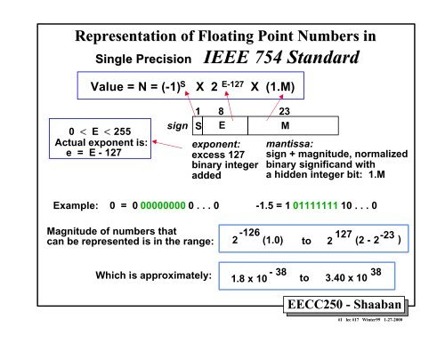
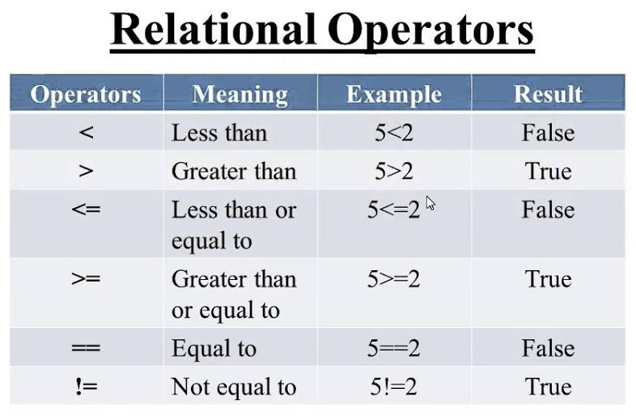
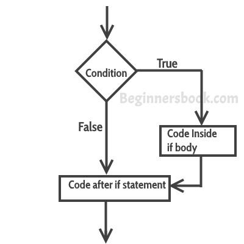
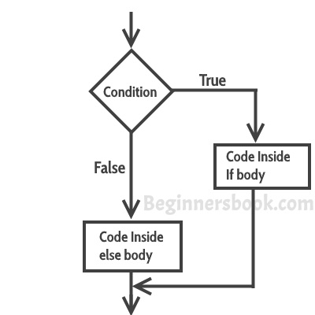

# Chapter 5: Making Choices (Boolean Variables)

## A Boolean Type

Named after George Boole (1815-1864), a boolean variable, 
of type ```bool``` takes on one of two values: 
```True``` or ```False```.


Boolean variables are lurking in the background behind all kinds of objects. 
Recall the ASCII table from the last demo, in which binary variables are mapped 
to the ASCII character set. 


A similar structure is in place behind common number formats, 
such as the 32-bit real numbers. 



In Python, we can work with binary variables, or Boolean variables, 
as objects of interest in their own right. 


### Boolean Operators

The negation ```not``` is a unary operator on type ```bool```

```python 
>>> not True
False
>>> not False
True
``` 
It negates, or reverses, the Boolean variable, 
from ```False``` to ```True``` or vice versa. 

The binary operator ```and``` returns ```True``` only if both
operands are ```True```.

```python 
>>> True and True
True
>>> False and False
False
>>> True and False
False
>>> False and True
False

``` 
The binary operator ```or``` returns ```True``` if either
one of the operands are ```True```.

```python 
>>> True or True
True
>>> False or False
False
>>> True or False
True
>>> False or True
True

``` 

As with any other value, you can store these as variables. 
```python 
>>> cold = True
>>> windy = False
>>> (not cold) and windy
False
>>> not (cold and windy)
True
``` 


#### Building an Exclusive ```or``` Expression

The *exclusive or* operand returns ```True``` if only one
of the operands is ```True```. 

If you want an exclusive ```or```, you can construct it from 
multiple Boolean operators. 

```python 
>>> b1 = False
>>> b2 = False
>>> (b1 and not b2) or (b2 and not b1)
False
>>> b1 = False
>>> b2 = True
>>> (b1 and not b2) or (b2 and not b1)
True
>>> b1 = True
>>> b2 = False
>>> (b1 and not b2) or (b2 and not b1)
True
>>> b1 = True
>>> b2 = True
>>> (b1 and not b2) or (b2 and not b1)
False

``` 

We will see an easier way to do this after introducing more operators.


### Relational Operators

Relational operators are used to determine whether certain relationships hold when comparing other variables.
These operators compare the operands to produce a Boolean variable.
They are commonly used for flow control, such as for ```if``` statements, discussed below.
Some of the most common relational operators are shown in the following table.




Inequality signs are a primary example of a relational operator.

```python 
>>> 45 > 34
True
>>> 45 > 79
False
>>> 45 < 79
True
>>> 45 < 34
False
``` 
The default is strict inequality but the "equal" case
is specified by adding an equal sign. 
```python 
>>> 23.1 >= 23
True
>>> 23.1 >= 23.1
True
>>> 23.1 <= 23.1
True
>>> 23.1 <= 23
False

``` 


A double equal sign ```==``` denotes a test for equality
of the operands and returns ```True``` if they are equal. 
```python 
>>> 67.3 == 87
False
>>> 67.3 == 67
False
>>> 67.0 == 67
True
```

The exclamation mark ```!``` denotes negation, 
so the combined operator ```!=``` tests for inequality, 
returning ```True``` only if the operands are not equal. 
```python
>>> 67.0 != 67
False
>>> 67.0 != 23
True
``` 


The examples above show how the operators work but 
these operators are more interesting and useful when 
the operands are variables, such as ```x``` in the ```is_positive``` function, 
which is another way to evaluate Boolean variables. 
```python 
>>> def is_positive(x: float) -> bool:
...     """Return True iff x is positive.
...
...     >>> is_positive(3)
...     True
...     >>> is_positive(-4.6)
...     False
...     """
...     return x > 0
...
>>> is_positive(3)
True
>>> is_positive(-4.6)
False
>>> is_positive(0)
False

``` 

Now we can revisit the example with exclusive ```or``` operator, 
applied to two variables of type ```bool```. 

```python
b1 != b2
```
This expression returns ```True``` only if exactly one of them is ```True```. 
Consider all the possible combinations of ```True``` and ```False``` for each variable, if you need to convince yourself.


### Combining Comparisons

You can pass other expressions as the operands in relational operators. 
Just as with numbers, there is an order of operations with type ```bool```.

1. Arithmetic operators are evaluated first: 
you have to know the values you are comparing first. 
1. Relational operators all have the same precedence, after arithmetic operators. 
1. Boolean opearators like ```and```, ```or``` and ```not``` are evaluated last: again, you have to know the values you are comparing first. 

Once you know these rules, you can avoid typing parentheses. 

```python 
>>> x = 2
>>> y = 5
>>> z = 7
>>> x < y and y < z
True

``` 
This returns the same:

```python 
>>> x = 5
>>> y = 10
>>> z = 20
>>> (x < y) and (y < z)
True

``` 

These examples determine whether a number lies within an interval. 
```python 
>>> x = 3
>>> (1 < x) and (x <= 5)
True
>>> x = 7
>>> (1 < x) and (x <= 5)
False

``` 

You can also write it the way it would be written on paper, 
by *chaining* the comparisons. 

```python 
>>> x = 3
>>> 1 < x <= 5
True

``` 
Most cases work as you expect but sometimes there are surprises:

```python 
>>> 3 < 5 != True
True
>>> 3 < 5 != False
True

``` 

Recall the order of operations: the relational operator
is evaluated first and ```5``` is neither ```True``` nor ```False```. 


#### Using Numbers and Strings with Boolean Operators

A zero is ```False``` and all other numbers return ```True```.

```python 
>>> not 0
True
>>> not 1
False
>>> not 34.2
False
>>> not -87
False

``` 
Similarly for strings, the empty string```''``` returns ```False```
and all other strings return ```True```. 

```python 
>>> not ''
True
>>> not 'bad'
False

``` 


### Short Circuit Evaluation

When evaluating a Boolean expression, once Python
has enough information to know that a condition is 
```True``` or ```False```, it stops evaluating. 
This is called *short circuit evaluation*. 

For example, in an ```or``` expression, once one operand is ```True```, 
the full expression returns ```True```.

We can illustrate this with an opearand that throws an error. 

```python 
>>> 1 / 0
Traceback (most recent call last):
  File "<stdin>", line 1, in <module>
ZeroDivisionError: division by zero

``` 
Now try this in an ```or``` expression: 

```python 
>>> (2 < 3) or (1 / 0)
True

``` 

What happened? Python didn't bother evaluating the second operator, 
avoiding the error. 


### Comparing Strings

Python compares strings by the corresponding binary values in an
ASCII table. 
In this ordering, the capital letters come first. 

```python 
>>> 'A' < 'a'
True
>>> 'A' > 'z'
False
```

If a shorter string runs out of letters, it is less than the other. 

```python 
>>> 'abc' < 'abd'
True
>>> 'abc' < 'abcd'
True

``` 

The ```in``` operator checks whether a string is contained within another string. 
```python 
>>> 'Jan' in '01 Jan 1838'
True
>>> 'Feb' in '01 Jan 1838'
False
>>> date = input('Enter a date in the format DD MTH YYYY: ')
Enter a date in the format DD MTH YYYY: 24 Feb 2013
>>> 'Jan' in date
False
>>> date = input('Enter a date in the format DD MTH YYYY: ')
Enter a date in the format DD MTH YYYY: 03 Jan 2002
>>> 'Jan' in date
True
>>> 'a' in 'abc'
True
>>> 'A' in 'abc'
False
>>> '' in 'abc'
True
>>> '' in ''
True

``` 


## Choosing Which Statements to Execute

The primary purpose of Boolean variables is for Python to
follow different instructions under different conditions.
The ```if``` statement is used to execute the commands in a block of code 
only if certain conditions hold. 
As shown in this flow chart, the program will skip that block of code and continue below
when the condition is not satisfied. 




In ```Python``` the syntax for an ```if``` statement is

```python
if <condition>:
    # Execute statements when condition is True.
    # ...


# Continue with remaining statements in any case.
```


An ```if``` statement evaluates conditions in a code block 
if the condition is ```True```, as in the following example. 

```python 
>>> ph = float(input('Enter the pH level: '))
Enter the pH level: 6.0
>>> if ph < 7.0: 
...     print(ph, "is acidic.")
... 
6.0 is acidic.

``` 

If the condition is not true, nothing happens.

```python 
>>> ph = float(input('Enter the pH level: '))
Enter the pH level: 8.0
>>> if ph < 7.0:
...     print(ph, "is acidic.")
...
>>>

``` 


Just as with the ```def``` keyword, the block of statements
must be indented.

```python 
>>> ph = float(input('Enter the pH level: '))
Enter the pH level: 6
>>> if ph < 7.0:
... print(ph, "is acidic.")
  File "<stdin>", line 2
    print(ph, "is acidic.")
        ^
IndentationError: expected an indented block
``` 

If the condition is ```True```, the entire block will
be executed. 


```python 
>>> ph = float(input('Enter the pH level: '))
Enter the pH level: 6.0
>>> if ph < 7.0:
...     print(ph, "is acidic.")
...     print("You should be careful with that!")
... 
6.0 is acidic.
You should be careful with that!

``` 

Any statements that are not indented after the block 
will be executed regardless of the condition for the 
indented block. 

```python 
>>> ph = float(input('Enter the pH level: '))
Enter the pH level: 8.0
>>> if ph < 7.0:
...     print(ph, "is acidic.")
... 
>>> print("You should be careful with that!")
You should be careful with that!
``` 

The commands following the block of commands in the ```if``` statements
must be separated by a blank line to signal the end of the ```if``` statement: 

```python 
>>> ph = float(input('Enter the pH level: '))
Enter the pH level: 8.0
>>> if ph < 7.0:
...     print(ph, "is acidic.")
... print("You should be careful with that!")
  File "<stdin>", line 3
    print("You should be careful with that!")
        ^
SyntaxError: invalid syntax
``` 

This is not a problem when the ```if``` condition is ```False```. 

```python 
ph = 8.0
if ph < 7.0:
    print(ph, "is acidic.")
print("You should be careful with that!")

``` 

Another ```if``` statement can follow right after
the previous one, regardless of the outcome of the first. 

```python 
>>> ph = float(input('Enter the pH level: '))
Enter the pH level: 8.5
>>> if ph < 7.0:
...     print(ph, "is acidic.")
...
>>> if ph > 7.0:
...     print(ph, "is basic.")
...
8.5 is basic.
>>>
``` 


Sometimes it is necessary to execute one command if a contition is ```True```
and execute other commands when the condition is ```False``` 
but avoid executing these other commands if the condition is ```True``



In the flow chart above, the program executes the first block of code then skips the second block when ```<condition> == True```.
When ```<condition>``` is ```False```, the interpreter skips the first block of code and runs only the second. 

```python
if <condition>:
    # Execute statements when condition is TRUE.
    # ...
else:
    # Execute statements when condition is FALSE.

```


We can merge the above examples by following the block with an ```elif```, 
which stands for "else if". 
This adds a second condition to be evaluated if the first condition
is ```False```. 

```python 
>>> ph = float(input('Enter the pH level: '))
Enter the pH level: 8.5
>>> if ph < 7.0:
...     print(ph, "is acidic.")
... elif ph > 7.0:
...     print(ph, "is basic.")
...
8.5 is basic.
>>>
``` 

Notice that the sequence of ```if``` and ```elif``` statements
may not cover all possibilities. 

```python 
>>> ph = float(input('Enter the pH level: '))
Enter the pH level: 7.0
>>> if ph < 7.0:
...     print(ph, "is acidic.")
... elif ph > 7.0:
...     print(ph, "is basic.")
...
>>>
``` 

The ```elif``` statement accomplished the same thing as the 
```if``` statement. 
This is not always the case, particularly if the first block
changes the value of the variables. 

```python 
>>> ph = float(input('Enter the pH level: '))
Enter the pH level: 6.0
>>> if ph < 7.0:
...     ph = 8.0
...
>>> if ph > 7.0:
...     print(ph, "is acidic.")
...
8.0 is acidic.
```

The first block changed the value of the ```ph``` variable, 
changing the outcome in the second block. 
This is not the case when the blocks are connected with an ```elif``` statement. 

```python 
>>> ph = float(input('Enter the pH level: '))
Enter the pH level: 6.0
>>> if ph < 7.0:
...     ph = 8.0
>>> elif ph > 7.0:
...     print(ph, "is acidic.")
...
>>>
``` 

In this case, the ```elif``` block is skipped. 


You can chain multiple ```elif``` statements to test a sequence of conditions. 

```python 
>>> compound = input('Enter the compound: ')
Enter the compound: CH4
>>> if compound == "H2O":
...     print("Water")
... elif compound == "NH3":
...     print("Ammonia")
... elif compound == "CH4":
...     print("Methane")
...
Methane
>>>
``` 


If none of the conditions are satisfied, nothing is executed, 
which may not be what you want. 
The ```else``` statement is executed in this case. 

```python 
>>> compound = input('Enter the compound: ')
Enter the compound: H2SO4
>>> if compound == "H2O":
...     print("Water")
... elif compound == "NH3":
...     print("Ammonia")
... elif compound == "CH4":
...     print("Methane")
... else:
...     print("Unknown compound")
...
Unknown compound
>>>
``` 


## Nested ```if``` Statements

An ```if``` statement block can contain any kind of Python
statement, including another ```if``` statement. 
The inner ```if``` statement is called a *nested if statement*. 

```python 
value = input('Enter the pH level: ')
if len(value) > 0:
    ph = float(value)
    if ph < 7.0:
        print(ph, "is acidic.")
    elif ph > 7.0:
        print(ph, "is basic.")
    else:
        print(ph, "is neutral.")
else:
    print("No pH value was given!")

``` 


## Exercises


### Exercise 9

```python 
>>> ph = 2
>>> if ph < 7.0:
...     print(ph, "is acidic.")
... elif ph < 3.0:
...     print(ph, "is VERY acidic! Be careful.")
...
2 is acidic.
``` 


What happens when ```ph = 6.4```?

What happens when ```ph = 3.6```?

Is this the intended result? If not, how could you fix it? 


### Exercise 10

```python 
ph = float(input("Enter the ph level: "))
if ph < 7.0:
    print("It's acidic!")
elif ph < 4.0:
    print("It's a strong acid!")
``` 

What happens when ```ph = 6.4```?

What happens when ```ph = 3.6```?

Is this the intended result? If not, how could you fix it? 
Consider a different approach from the example above. 

What change would you make to print both messages when they are true?
