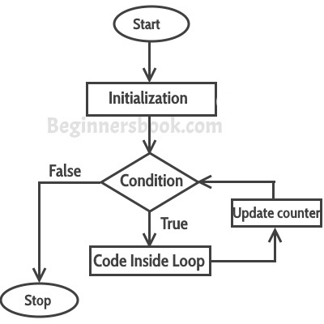

# Chapter 9: Repeating Code Using Loops


## Repetition

Repetition is used to perform a fixed sequence of operations a number of times by iterating over a block of code. 
There are two main kinds of repetition that differ in the way the user specifies the sequence and number of executions.

#### ```for``` loops

For loops are useful when you have to repeat a calculation for a 
predetermined number of inputs. 
These calculations follow this flow chart:



After an *iteration* is performed, the interpreter automatically *increments* the *iterator* 
to the next value to repeat the calculation, until all iterations are performed.  
The syntax is:

```python
for iterator in list_of_iterators:
    # Execute statements for each object in the list of iterators.
    # ...
    # Don't forget the indenting. 

```


## Processing Items in a List

Until now, if you wanted to execute commands over items in a list, 
you might have to write the same command many times.

```python 
>>> velocities = [0.0, 9.81, 19.62, 29.43]
>>> print('Metric:', velocities[0], 'm/sec;',
... 'Imperial:', velocities[0] * 3.28, 'ft/sec')
Metric: 0.0 m/sec; Imperial: 0.0 ft/sec
>>> print('Metric:', velocities[1], 'm/sec;',
... 'Imperial:', velocities[1] * 3.28, 'ft/sec')
Metric: 9.81 m/sec; Imperial: 32.1768 ft/sec
>>> print('Metric:', velocities[2], 'm/sec; ',
... 'Imperial:', velocities[2] * 3.28, 'ft/sec')
Metric: 19.62 m/sec; Imperial: 64.3536 ft/sec
>>> print('Metric:', velocities[3], 'm/sec; ',
... 'Imperial:', velocities[3] * 3.28, 'ft/sec')
Metric: 29.43 m/sec; Imperial: 96.5304 ft/sec

``` 

Instead, you can execute the same sequence of commands 
using a ```for``` loop. 

```python 
>>> velocities = [0.0, 9.81, 19.62, 29.43]
>>> for velocity in velocities:
...     print('Metric:', velocity, 'm/sec;',
...     'Imperial:', velocity * 3.28, 'ft/sec')
...
Metric: 0.0 m/sec; Imperial: 0.0 ft/sec
Metric: 9.81 m/sec; Imperial: 32.1768 ft/sec
Metric: 19.62 m/sec; Imperial: 64.3536 ft/sec
Metric: 29.43 m/sec; Imperial: 96.5304 ft/sec

``` 

A ```for``` loop executes commands as follows.
1. The loop variable, or *iterator*, is assigned the first item in the list. 
1. The loop *block* of statements is executed, possibly using the iterator as an input (although not necessarily).
1. The loop variable is assigned the second variable in the list and the block of statements is executed again. 
1. The program continues iterating over the remaining items in the list.


Regardless of whether the variable name of the iterator is assigned a value 
before the loop, the iterator is assigned the first item in the list upon entering the loop. 

```python 
>>> speed = 2
>>> velocities = [0.0, 9.81, 19.62, 29.43]
>>> for speed in velocities:
...     print('Metric:', speed, 'm/sec')
... 
Metric: 0.0 m/sec
Metric: 9.81 m/sec
Metric: 19.62 m/sec
Metric: 29.43 m/sec
>>> print('Final:', speed)
Final: 29.43
``` 

After the loop is executed, the iterator remains in memory
with the last value in the list that was executed. 
This is useful information when the loop terminates early, 
such as when an error occurs.


## Processing Characters in Strings

You can loop over the characters in a string.

```python 
>>> country = 'United States of America'
>>> for ch in country:
...     if ch.isupper():
...         print(ch)
... 
U
S
A
``` 


## Looping Over a Range of Numbers

The ```range``` function is useful for generating a sequence of integers. 


```python 
>>> range(10)
range(0, 10)
``` 
To see the individual elements, print them out one at a time. 

```python 
>>> for num in range(10):
...     print(num)
... 
0
1
2
3
4
5
6
7
8
9
``` 
Notice that it stops at 9, so the index follows every element
in a list with 10 elements. 

```python 
>>> list(range(10))
[0, 1, 2, 3, 4, 5, 6, 7, 8, 9]
``` 

You can use the ```list``` function to convert the range to a list. 
Some examples include:

```python 
>>> list(range(3))
[0, 1, 2]
>>> list(range(1))
[0]
>>> list(range(0))
[]
``` 
Note that the default starting point is 0 and a range of length zero
produces an empty range of values. 

If two arguments are passed to ```range```, the first is the ```start``` value. 

```python 
>>> list(range(1, 5))
[1, 2, 3, 4]
>>> list(range(1, 10))
[1, 2, 3, 4, 5, 6, 7, 8, 9]
>>> list(range(5, 10))
[5, 6, 7, 8, 9]
``` 
The default step size is 1 if there is no third argument. 
With the *step size* of 4, this is a list of leap years in this century:

```python 
>>> list(range(2000, 2050, 4))
[2000, 2004, 2008, 2012, 2016, 2020, 2024, 2028, 2032, 2036, 2040, 2044, 2048]

``` 
With a negative step size, the range lists elements in reverse order. 

```python 
>>> list(range(2050, 2000, -4))
[2050, 2046, 2042, 2038, 2034, 2030, 2026, 2022, 2018, 2014, 2010, 2006, 2002]

``` 
Notice that the list ended at the last element in the sequence before the ```stop``` value. 
Similarly, if the step size goes in the opposite direction, 
the range will be empty. 

```python 
>>> list(range(2000, 2050, -4))
[]
>>> list(range(2050, 2000, 4))
[]

``` 

You can use a range to direct a sequence of calculations in a ```for``` loop. 

```python 
>>> total = 0
>>> for i in range(1, 101):
...     total = total + i
... 
>>> total
5050

``` 


## Processing Lists Using Indices

If you want to double the values in a list, the following won't work:

```python 
>>> values = [4, 10, 3, 8, -6]
>>> for num in values:
...     num = num * 2
... 
>>> values
[4, 10, 3, 8, -6]
``` 
The iterator ```num``` is overwritten by its double
but it is reset on each iteration to the next item in the loop. 

That loop did, however, change the value of the iterator ```num```
within the loop block of statements. 


```python 
>>> values = [4, 10, 3, 8, -6]
>>> for num in values:
...     num = num * 2
...     print(num)
... 
8
20
6
16
-12
>>> print(values)
[4, 10, 3, 8, -6]

``` 

It is generally bad form to change the iterator within a loop. 
It can be confusing to other users of your code. 
Instead, loop over the indices of the list. 
First, create an appropriate range of values for the iterator. 

```python 
>>> values = [4, 10, 3, 8, -6]
>>> len(values)
5
>>> list(range(5))
[0, 1, 2, 3, 4]
>>> list(range(len(values)))
[0, 1, 2, 3, 4]

``` 
Now execute a loop to verify the values of the iterator. 
```python 
>>> values = [4, 10, 3, 8, -6]
>>> for i in range(len(values)):
...     print(i)
... 
0
1
2
3
4
``` 
Next, add the commands that involve the elements of the list, 
using the iterator ```i``` to reference the elements. 
```python 
>>> values = [4, 10, 3, 8, -6]
>>> for i in range(len(values)):
...     print(i, values[i])
... 
0 4
1 10
2 3
3 8
4 -6

``` 
With this approach, you can modify the list items. 
```python 
>>> values = [4, 10, 3, 8, -6]
>>> for i in range(len(values)):
...     values[i] = values[i] * 2
... 
>>> values
[8, 20, 6, 16, -12]
``` 


### Processing Parallel Lists Using Indices

Sometimes you have multiple sources of data, each with elements 
that are related to the elements of the other lists. 

```python 
>>> metals = ['Li', 'Na', 'K']
>>> weights = [6.941, 22.98976928, 39.0983]
``` 

You can write a loop to iterate over both at the same time. 


```python 
>>> metals = ['Li', 'Na', 'K']
>>> weights = [6.941, 22.98976928, 39.0983]
>>> for i in range(len(metals)):
...     print(metals[i], weights[i])
... 
Li 6.941
Na 22.98976928
K 39.0983
``` 

## Nesting Loops in Loops

Just like you can use nested ```if``` statements, you can use nested loops. 

```python 
>>> outer = ['Li', 'Na', 'K']
>>> inner = ['F', 'Cl', 'Br']
>>> for metal in outer:
...     for halogen in inner:
...         print(metal + halogen)
...
...
LiF
LiCl
LiBr
NaF
NaCl
NaBr
KF
KCl
KBr

``` 

Sometimes the inner loop uses the same list of values as the outer loop. 


```python 
def print_table(n: int) -> None:
    """Print the multiplication table for numbers 1 through n inclusive.

    >>> print_table(5)
        1       2       3       4       5
    1   1       2       3       4       5
    2   2       4       6       8       10
    3   3       6       9       12      15
    4   4       8       12      16      20
    5   5       10      15      20      25
    """
    # The numbers to include in the table.
    numbers = list(range(1, n + 1))

    # Print the header row.
    for i in numbers:
        print('\t' + str(i), end='')

    # End the header row.
    print()

    # Print each row number and the contents of each row.
    for i in numbers:  #(1)

        print (i, end='')  #(2)
        for j in numbers:   #(3)
            print('\t' + str(i * j), end='') #(4)

        # End the current row.
        print() #(5)

``` 
Run this loop and trace the numbered steps 
to the parts of the multiplication table.


### Looping Over Nested Lists

The nested loops can be run over nested lists. 
The outer loop iterates over the sublists. 

```python 
>>> elements = [['Li', 'Na', 'K'], ['F', 'Cl', 'Br']]
>>> for inner_list in elements:
...     print(inner_list)
... 
['Li', 'Na', 'K']
['F', 'Cl', 'Br']

``` 
The inner loop iterates over the elements of the sublists. 
```python 
>>> elements = [['Li', 'Na', 'K'], ['F', 'Cl', 'Br']]
>>> for inner_list in elements:
...     for item in inner_list:
...         print(item)
... 
Li
Na
K
F
Cl
Br
``` 


### Looping Over Ragged Lists

The nested lists do not have to have the same length. 
Just be careful to iterate over the elements in the inner lists. 
Use the ```len``` function to determine the lengths of those sublists. 

```python 
>>> info = [['Isaac Newton', 1643, 1727],
...         ['Charles Darwin', 1809, 1882],
...         ['Alan Turing', 1912, 1954, 'alan@bletchley.uk']]
>>> for item in info:
...     print(len(item))
...
3
3
4

``` 
Many data sources produce ragged data. 
For example, this list shows the time a test subject drank water each day. 
```python 
>>> drinking_times_by_day = [["9:02", "10:17", "13:52", "18:23", "21:31"],
...                          ["8:45", "12:44", "14:52", "22:17"],
...                          ["8:55", "11:11", "12:34", "13:46",
...                           "15:52", "17:08", "21:15"],
...                          ["9:15", "11:44", "16:28"],
...                          ["10:01", "13:33", "16:45", "19:00"],
...                          ["9:34", "11:16", "15:52", "20:37"],
...                          ["9:01", "12:24", "18:51", "23:13"]]
>>> for day in drinking_times_by_day:
...     for drinking_time in day:
...         print(drinking_time, end=' ')
...     print()
...
9:02 10:17 13:52 18:23 21:31
8:45 12:44 14:52 22:17
8:55 11:11 12:34 13:46 15:52 17:08 21:15
9:15 11:44 16:28
10:01 13:33 16:45 19:00
9:34 11:16 15:52 20:37
9:01 12:24 18:51 23:13
``` 
The inner loop prints the times in the rows each day. 
The empty print statement creates a new line, 
so the times in the next day are listed on the next line. 


## Looping Until a Condition is Reached

With a ```for``` loop, you need to know the list of iterators beforehand. 
Sometimes, you know only a condition under which the calculation should be stopped. 
The ```while``` loop executes the block of code until the condition is no longer satisfied. 


#### ```while``` loops

Sometimes these loops are useful when you don't know in advance
how many times the calculation must be performed because the condition
depends on the previous steps. 
Alternatively, your calculation might be continued until some level of *tolerance* is achieved. 

A ```while``` loop has the following flow chart:


The commands follow a sequence of commands like this:

```python

while <condition>:
    # Execute statements when condition is TRUE.
    # ...
    # condition may change during an iteration.
    # ...
    # At end of block, evaluate condition and determine whether
    # to execute the code block again. 
    
    # Don't forget to indent consistently.
    # The block of code ends when the last
    # indented statements are executed. 

```

Consider this simple example:

```python 
>>> rabbits = 3
>>> while rabbits > 0:
...     print(rabbits)
...     rabbits = rabbits - 1
...
3
2
1
``` 
Notice that the condition is initialized to a value that is ```True```,
so the ```while``` loop is executed, otherwise it is skipped. 

The following loop calculates a sequence of values following a
path of exponential growth. 

```python 
time = 0
population = 1000   # 1000 bacteria to start with
growth_rate = 0.21 # 21% growth per minute
while population < 2000:
    population = population + growth_rate * population
    print(round(population))
    time = time + 1
	
print("It took", time, "minutes for the bacteria to double.")
print("The final population was", round(population), "bacteria.")

``` 
It prints the following output. 
```python 
1210
1464
1772
2144
It took 4 minutes for the bacteria to double.
The final population was 2144 bacteria.
``` 
Notice that the last instance of population was greater than the 
stopping criterion, since Python executed one more loop after the 
last value of ```1772 < 2000```. 


### Infinite Loops

If we set the stopping condition to be *exactly* 2000, 
what happens?

```python 
# Use multi-valued assignment to set up controls
time, population, growth_rate = 0, 1000, 0.21

# Don't stop until we're exactly double the original size
while population != 2000:
    population = population + growth_rate * population
    print(round(population))
    time = time + 1

print("It took", time, "minutes for the bacteria to double.")

``` 

```python 
1210
1464
1772
2144
...3,680 lines or so later...
inf
inf
inf
...and so on forever...
``` 

The value ```inf``` represents the symbol for infinity. 
It is reached when the number hits the largest possible value for that data type. 
This loop will not stop unless you end it. 
If you find that you have created an infinite loop,
press ```Ctrl-C``` in most shells, or press the stop button
in Anaconda, which is a square button in the console. 


## Repetition Based on User Input

You can use the ```input``` command to request user input from the keyboard
and use this value to trigger the stopping condition. 

```python 
text = ""
while text != "quit":
    text = input("Please enter a chemical formula (or 'quit' to exit): ")
    if text == "quit":
        print("...exiting program")
    elif text == "H2O":
        print("Water")
    elif text == "NH3":
        print("Ammonia")
    elif text == "CH4":
        print("Methane")
    else:
        print("Unknown compound")

``` 
If the user enters the following sequence of values, 
the program will run as follows.

```python 
Please enter a chemical formula (or 'quit' to exit): CH4
Methane
Please enter a chemical formula (or 'quit' to exit): H2O
Water
Please enter a chemical formula (or 'quit' to exit): quit
...exiting program

``` 


## Controlling Loops Using ```break``` and ```continue```

Two commands can alter the sequence of iterations: ```break``` and ```continue```. 

### The ```break``` Statement

The ```break``` command stops the loop and exits the block of commands, 
moving on to the statements after the loop. 

```python 
while True:
    text = input("Please enter a chemical formula (or 'quit' to exit): ")
    if text == "quit":
        print("...exiting program")
        break
    elif text == "H2O":
        print("Water")
    elif text == "NH3":
        print("Ammonia")
    elif text == "CH4":
        print("Methane")
    else:
        print("Unknown compound")

``` 
Although this works, many programmers judge this to be bad form. 
It is more clear to the user when the iterations and stopping conditions
are explicitly stated after the ```for``` or ```while``` keywords. 


Sometimes you will want to use the ```break``` command
when you are looking for something and want to stop looking after 
you have found what you are looking for. 

In this case, the loop wastefuly continues until the end of the range,
regardless of when the digit is found. 

```python 
>>> s = 'C3H7'
>>> digit_index = -1 # This will be -1 until we find a digit.
>>> for i in range(len(s)):
...     # If we haven't found a digit, and s[i] is a digit
...     if digit_index == -1 and s[i].isdigit():
...         digit_index = i
...
>>> digit_index
1
``` 
With the ```break``` statement, the loop stops when the job is done. 

```python 
>>> s = 'C3H7'
>>> digit_index = -1 # This will be -1 until we find a digit.
>>> for i in range(len(s)):
...     # If we find a digit
...     if s[i].isdigit():
...         digit_index = i
...         break  # This exits the loop.
...
>>> digit_index
1
``` 


### The ```continue``` Statement

The ```continue``` statement also alters the flow of a loop. 
This command ends the execution within the current block of commands
and it immediately proceeds to the next iteration and executes the loop block. 

Without the ```continue``` statement, the execution 
proceeds even after finding a letter (an ```alpha```betic character)
that cannot be counted in the total. 

```python 
>>> s = 'C3H7'                   
>>> total = 0                    
>>> count = 0                    
>>> for i in range(len(s)):      
...     if not s[i].isalpha():
...         total = total + int(s[i])
...         count = count + 1
... 
>>> total
10
>>> count
2

``` 
This version stops the calculation in the loop 
if the character is not numeric and proceeds to the next 
character. 
```python 
>>> s = 'C3H7'
>>> total = 0 # The sum of the digits seen so far.
>>> count = 0 # The number of digits seen so far.
>>> for i in range(len(s)):
...     if s[i].isalpha():
...         continue
...     total = total + int(s[i])
...     count = count + 1
...
>>> total
10
>>> count
2

``` 
These two programs produce the same output. 


### A Warning About ```break``` and ```continue```

Although these are useful tools, they should be used sparingly 
(or never, according to many programmers) as they may unnecessarily 
complicate the program.
Many programmers will not notice the ```break``` and ```continue``` statements
and will get confused after using the ```for``` and ```while```
statement to get an idea of what the program is doing. 
This advice is not only to help others:
your program might make sense to you now
but *future you* might not remember what you are doing. 


## Exercises

### Exercise 12:

```python 
from typing import List

def remove_neg(num_list: List[float]) -> None:
    """Remove the negative numbers from the list num_list.

    >>> numbers = [-5, 1, -3, 2]
    >>> remove_neg(numbers)
    >>> numbers
    [1, 2]
    """

    for item in num_list:
        if item < 0:
            num_list.remove(item)

``` 

