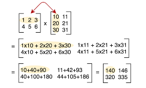
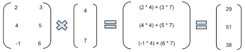

# Chapter 6: A Modular Approach to Program Organization

You can often solve problems by using programs 
and functions designed by others, rather than solving these 
problems on your own. 
A great advantage of Python is that there is a large community 
of programmers who contribute their own functions.
The typical unit for a set of functions and programs is a *module*. 


## Importing Modules

To gain access to the functions in a module, you *import* it.

```python 
import math
```
The ```math``` module contains a set of mathematical operations. 

A module has type ```module```.
```python 
>>> type(math)
<class 'module'>
``` 
You can acces the help for all the functions in a module just as you
would for a single function, with the ```help``` function. 

```python 
>>> help(math)
Help on module math:

NAME
    math

MODULE REFERENCE
    https://docs.python.org/3.6/library/math

    The following documentation is automatically generated from the Python
    source files.  It may be incomplete, incorrect or include features that
    are considered implementation detail and may vary between Python
    implementations.  When in doubt, consult the module reference at the
    location listed above.

DESCRIPTION
    This module is always available.  It provides access to the
    mathematical functions defined by the C standard.

FUNCTIONS
    acos(...)
        acos(x)
        Return the arc cosine (measured in radians) of x.

    acosh(...)
        acosh(x)
        Return the inverse hyperbolic cosine of x.

[Lots of other functions not shown here.]

``` 

Many common functions--many functions that you might expect would come 
standard with Python--are not available unless you import them
in a module,

```python 
>>> sqrt(9)
Traceback (most recent call last):
  File "<stdin>", line 1, in <module>
NameError: name 'sqrt' is not defined

``` 
After the ```import math``` statement, these functions are available
using the prefix ```math```. 

```python 
>>> math.sqrt(9)
3.0

``` 
Even the number ```pi``` requires the ```math``` module, 
along with other constants. 

```python 
>>> import math
>>> math.pi
3.141592653589793
>>> radius = 5
>>> print('area is', math.pi * radius ** 2)
area is 78.53981633974483

``` 

You *could* overwrite these values, since they are variables 
like any other, but that is a bad idea, since users would not expect this. 


```python 
>>> import math
>>> math.pi = 3 # DON'T do this!
>>> radius = 5
>>> print('area is', math.pi * radius ** 2)
area is 75

``` 
You don't need to import the entire module. 
You could import only the particular functions and constants that you need. 
When you use the ```from``` statement, it pulls certain elements
by name. 

```python 
>>> from math import sqrt, pi
>>> sqrt(9)
3.0
>>> radius = 5
>>> print('circumference is', 2 * pi * radius)
circumference is 31.41592653589793

``` 
Now these can be referenced as they are named. 
Since they have different names, there are no functions under the
usual name that would be assigned if the entire module were imported. 

```python 
>>> from math import sqrt, pi
>>> math.sqrt(9)
Traceback (most recent call last):
  File "<pyshell#12>", line 1, in <module>
    math.sqrt(9)
NameError: name 'math' is not defined
>>> sqrt(9)
3.0
``` 


A good practice is to select only the functions you need. 
Otherwise, if you select all the functions (using the *wildcard* ```*```)
many functions will be imported into the namespace, 
which could cause conflicts with other variables. 


```python 
>>> from math import *
>>> print(sqrt(8))
2.8284271247461903

``` 


#### Module ```__builtins__```

Many functions are built into Python. 
These are collected within the ```__builtins__``` module. 
You might recognize some of the functions that we have used already. 

```python 
>>> dir(__builtins__)
['ArithmeticError', 'AssertionError', 'AttributeError', 'BaseException',
'BlockingIOError', 'BrokenPipeError', 'BufferError', 'BytesWarning',
'ChildProcessError', 'ConnectionAbortedError', 'ConnectionError',
'ConnectionRefusedError', 'ConnectionResetError', 'DeprecationWarning',
'EOFError', 'Ellipsis', 'EnvironmentError', 'Exception', 'False',
'FileExistsError', 'FileNotFoundError', 'FloatingPointError', 'FutureWarning',
'GeneratorExit', 'IOError', 'ImportError', 'ImportWarning', 'IndentationError',
'IndexError', 'InterruptedError', 'IsADirectoryError', 'KeyError',
'KeyboardInterrupt', 'LookupError', 'MemoryError', 'ModuleNotFoundError',
'NameError', 'None', 'NotADirectoryError', 'NotImplemented',
'NotImplementedError', 'OSError', 'OverflowError', 'PendingDeprecationWarning',
'PermissionError', 'ProcessLookupError', 'RecursionError', 'ReferenceError',
'ResourceWarning', 'RuntimeError', 'RuntimeWarning', 'StopAsyncIteration',
'StopIteration', 'SyntaxError', 'SyntaxWarning', 'SystemError', 'SystemExit',
'TabError', 'TimeoutError', 'True', 'TypeError', 'UnboundLocalError',
'UnicodeDecodeError', 'UnicodeEncodeError', 'UnicodeError',
'UnicodeTranslateError', 'UnicodeWarning', 'UserWarning', 'ValueError',
'Warning', 'ZeroDivisionError', '_', '__build_class__', '__debug__', '__doc__',
'__import__', '__loader__', '__name__', '__package__', '__spec__', 'abs', 'all',
'any', 'ascii', 'bin', 'bool', 'bytearray', 'bytes', 'callable', 'chr',
'classmethod', 'compile', 'complex', 'copyright', 'credits', 'delattr', 'dict',
'dir', 'divmod', 'enumerate', 'eval', 'exec', 'exit', 'filter', 'float',
'format', 'frozenset', 'getattr', 'globals', 'hasattr', 'hash', 'help', 'hex',
'id', 'input', 'int', 'isinstance', 'issubclass', 'iter', 'len', 'license',
'list', 'locals', 'map', 'max', 'memoryview', 'min', 'next', 'object', 'oct',
'open', 'ord', 'pow', 'print', 'property', 'quit', 'range', 'repr', 'reversed',
'round', 'set', 'setattr', 'slice', 'sorted', 'staticmethod', 'str', 'sum',
'super', 'tuple', 'type', 'vars', 'zip']

``` 

You should avoid naming any variable using the names of functions in 
the ```__builtins__``` module. 


## Application: Interacting with the Operating System with ```os```

When you run a program in the terminal window, python assumes that any
interaction with files will occur in the directory in which you are running the program.
That is, the default *working directory* is the location in which you run your python script. 
For many applications, such as working with data, you need your program to specify
the working directory from which the data can be located. 
The ```os``` module helps with this function. 
You write

```python
import os
```
typically, at the top of your script, along with the ```import```s of other modules.

First, you can find out where you are working right now with ```os.getcwd()```.
This function *get*s your *c*urrent *w*orking *d*irectory. 

```python
# Find out the current directory.
>>> os.getcwd()
'C:\\Users\\user_name\\path\\to\\other\\files'
```

Typically, in a GUI such as Anaconda, this will point at your default user location
but it may also be set to the place where you were last working.
*Ch*ange it to another *dir*ectory with ```os.chdir```

```python
# Change to a new directory.
>>> os.chdir('C:\\Users\\user_name\\path\\to\\folder\\I\\want')
```
This operation happens silently, if it worked. 

```python
>>> os.chdir('C:\\Users\\user_name\\path\\to\\folder\\I\\want')
```
If you want to verify the directory you just changed to, 
use the ```os.getcwd``` function again.

```python
>>> os.getcwd()
'C:\\Users\\user_name\\path\\to\\folder\\I\\want'
```
Hopefully, you get the folder you want. 
If the directory name is spelled wrong, it will not be changed 
and python will throw an error. 

```python
>>> os.chdir('C:\\Users\\user_name\\folder\\spelled\\incorrectly')
[WinError 3] The system cannot find the path specified: 'C:\\Users\\user_name\\folder\\spelled\\incorrectly'
>>> os.getcwd()
'C:\\Users\\user_name\\path\\to\\other\\files'
```

Notice, in the paths above, the double backslash ```\\```.
The first is the escape sequence for the second backslash
to be written in the string containing the path.
You have to change this yourself if you copy the path from
the address bar in a program such as Windows Explorer, 
because those paths will have forward slashes instead. 


```python
>>> os.chdir('C:\Users\user_name\folder\with\single\baskslashes')
"C:\Users\user_name\folder\with\single\baskslashes"
    ^
SyntaxError: (unicode error) 'unicodeescape' codec can't decode bytes in position 2-3: truncated \UXXXXXXXX escape
>>> os.getcwd()
'C:\\Users\\user_name\\path\\to\\other\\files'
```


## Application: Linear Algebra


When using computers to solve a problem, one approach is to fully understand the solution before attempting to write a program to solve the problem.
It is often very useful to conceptualize the calculation first and then use a concise specification from which to write the program.
This approach takes advantage of the fast and reliable computation of modern computers: computers can perform calculations more quickly and reliably than humans can by hand.

However, computers are capable of much more.
The above approach is very limited in terms of the nature of problems that can be solved.
Computers can be used to solve problems that you don't know how to solve. 
You can use computers to help you understand a problem as you formulate a solution procedure. 
The most important ingredient is having a precise way of stating the problem. 
In the following we will use the ```numpy``` and ```scipy```
modules to solve a *system of linear equations* for a vector of unknown parameters. 


### The problem

First, consider solving a *system of linear equations* for a vector of unknown parameters. 
The objective is to find a *vector* ```x``` that, when multiplied by the *matrix* ```A``` produces the *vector* ```b```: ```x``` satisfies ```A %*% x == b```.
It is necessary to first understand how this calculation is performed. 
In matrix multiplication, the numbers in the resulting matrix are calculated as the *dot product* of the corresponding rows and columns of the matrices that are multiplied. 
The calculation proceeds in the pattern shown in the following figure. 



The simplest such calculation is to solve for a single vector in the multiplication. 



Here, we are given the matrix ```A```, on the left, and the product ```b = c(29, 51, 38)``` on the right. 
The objective is to find the (unknown) vector ```x = c(4, 7)```, using only ```A``` and ```b```. 
The most common such problem is when the matrix ```A``` is square, 
that is, it has the same number of rows and columns.


### The Tools: Working with Matrices

Some languages are designed for matrix algebra. 
For example, when you use the statistical programming language ```R```,
the matrix multiplication operator is the symbol ```%*%```. 
In the first problem, it is used in the following ```R``` code.

```
A <- matrix(seq(6),
            nrow = 2,
            ncol = 3, 
            byrow = TRUE)
x <- matrix(c(10, 20, 30, 11, 21, 31),
            nrow = 3,
            ncol = 2)
b <- A %*% x

> b
     [,1] [,2]
[1,]  140  146
[2,]  320  335
```

Python operates vectors and matrices differently. 
It thinks of them as parameters in a function, 
such as the ```dot``` function in the ```numpy``` module. 

```python
import numpy as np

# Assign numbers to two numpy arrays.
>>> A = np.array([[1., 2., 3.], [4., 5., 6.]])
>>> x = np.array([[10., 11.], [20., 21.], [30., 31.]])
...
# Multiply these matrices together. 
>>> b = A.dot(x)
>>> b
array([[140., 146.],
       [320., 335.]])
>>> print(b)
[[140. 146.]
 [320. 335.]]
```


These numpy arrays have their own type. 

```python
>>> type(A)
numpy.ndarray
>>> type(x)
numpy.ndarray
>>> type(b)
numpy.ndarray
```

To extract values from the array, you can extract elements
just as you would for a list.

```python
>>> A[1]
array([4., 5., 6.])
>>> A[1][2]
6.0
```

Since these numpy arrays are 2-dimensional objects,
you can also extract the elements by passing a 
list of index numbers. 

```python
>>> A[1, 2]
6.0
```

Now that we know how to perform matrix multiplication, 
we can use it to solve for the unknown vector or matrix 
```x``` that produced the product ```b```.


### The solution

An inefficient way to solve this problem is to find the *inverse* of the matrix ```A``` and multipy it against ```b```. 
This works but it takes many more computational steps. 
A better approach is to use row oprations to perform a form of Gaussian elimination. 
Although this may be the approach taken for hand calculations, there are other, more efficient algorithms for finding the solution to a set of equations.
This is a specialized area within mathematics that uses advanced theories in linear algebra to calculate solutions. 
Fortunately, for the practitioner, most computational packages have built-in functions for solving systems of linear equations. 


### Solve a linear system with the inverse matrix

The conceptually simple--but computationally expensive--approach is to calculate the inverse of the matrix ```A``` and then multiply ```b``` to achieve the solution ```b```. 

```python
# Assign numbers to two numpy arrays.
>>> A = np.array([[1., 2.], [3., 4.]])
>>> b = np.array([1., 1.])

# Use the np.linalg.inv method to find the inverse.
>>> A_inv = np.linalg.inv(A)
>>> A_inv
array([[-2. ,  1. ],
       [ 1.5, -0.5]])

# Verify that A_inv is the inverse of A.
>>> A.dot(A_inv)
array([[1.00000000e+00, 1.11022302e-16],
       [0.00000000e+00, 1.00000000e+00]])
>>> A_inv.dot(A)
array([[1.0000000e+00, 4.4408921e-16],
       [0.0000000e+00, 1.0000000e+00]])
```
Since both of these products equal the identity matrix, 
```A_inv``` is the inverse of ```A```. 

Notice that the off-diagonal elements are not exactly zero.
Rounding errors occur when using numbers with finite precision. 


This is useful if the user needs to solve a series of equations with the same matrix ```A``` but a set of different different vectors ```b```.

### Solve a linear system without the inverse

In general, you would simply solve the system to obtain the solution. 
This requires fewer calculations and is all that is needed when only the solution is required. 


```python
# Use the np.linalg.solve method to find a solution x to the system
# of the form A*x = b
>>> soln = np.linalg.solve(A, b)
>>> soln
array([-1.,  1.])

# Check the solution
>>> A.dot(soln)
array([1., 1.])
```

Since ```A.dot(soln)``` equals ```b```, ```soln``` is the solution. 


In the linear regression model, for example, 
the objective is to find the value of the coefficients that minimize the sum of squared errors. 
This solution is often reduced, using calculus, to solution of a set of linear equations. 
We will see this in action in future demonstrations. 
To get there, we need a few more tools.


## Functions for creating arrays 


There are a number of convenient functions
for generating matrices of a specific form.

The ```zeros``` method creates an array of zeros.
```python
a = np.zeros((2,2))   
print(a)
```

The ```ones``` method creates an array of ones.
```python
b = np.ones((1,2))
print(b)
```

The ```full``` method creates a constant array. 
```python
c = np.full((2,2), 7)
print(c)
```

The ```eye``` method creates an identity matrix. 
```python
d = np.eye(2)
print(d)
```

The ```random.random``` method creates an array filled with random values.
```python
e = np.random.random((2,2))
print(e)
```
These are often useful for solving algebra problems,
since the syntax matches the symbols often used
on the blackboard.


## Examples Using ```scipy'''.


We still need to import ```numpy``` to create arrays.
We also import the ```linalg``` module from ```scipy```
to use tools for linear algebra.

```python
# Create an array for a 3x3 matrix. 
A = np.array([[1,3,5],[2,5,1],[2,3,8]])
A
```


Calculate the inverse ```A^{-1}```.
Roughly speaking, the inverse is defined as follows:
```A^{-1}``` satisfies ```A^{-1}*A = A*A^{-1} = I```, the identity matrix.
If ```x``` solves ```A*x = b```, then ```A^{-1}*b = x```.

```python
linalg.inv(A)
```

Verify that ```A^{-1}``` is, in fact, the identity matrix.


```python
A.dot(linalg.inv(A)) 
```
Note again that the off-diagonals are very small numbers
but not quite zero.
Recall that computers store numbers up to finite precision.
There are rounding errors.


Solve the above problem (in the numpy example) with the inverse.

```python
A = np.array([[1., 2.], [3., 4.]])
b = np.array([1., 1.])
```

Calculate the inverse matrix A^{-1}.

```python
A_inv = linalg.inv(A)
```

Multiply the vector ```b``` by the inverse ```A^{-1}```.
This also obtains a solution ```x``` to the system
of the form ```A*x = b```, since ```A^{-1}*b = x```.

```python
soln = A_inv.dot(b)
print(soln)
```

Check the solution.

```python
A.dot(soln)
```

Again, the product equals ```b```, so it's the solution.


## Solve the parameters in a nonlinear model.


This example uses the following modules.

```python
import numpy as np
from scipy import linalg
import matplotlib.pyplot as plt
```

We will generate an artificial dataset to show the fit of a model.

First, set the parameters.

```python
beta_0, beta_1 = 5.0, 2.0
```

Next, create a row vector from the range 1 to 10

```python
i = np.r_[1:11] 
```
(this notation produces the same output as ```np.array(range(1, 11))```).

Then, generate the explanatory variable, x. 

```python
xi = 0.1*i
```

Next, generate the dependent variable, y, with a nonlinear model.


```python
yi_true = beta_0*np.exp(-xi) + beta_1*xi
```

Finally, add an error term for some random variation.

```python
yi = yi_true + 0.25 * np.random.randn(len(yi_true))
```

To solve this system, arrange it into matrix form. 


```python
A = np.c_[np.exp(-xi)[:, np.newaxis], xi[:, np.newaxis]]
```

The ```newaxis``` argument increases the dimension of the array by one dimension
This is useful for creating objects one dimension higher.
This is used because we are binding column vectors together into
a matrix.

Solve the system by least squares (using the ```lstsq``` method).


```python
beta_hat, resid, rank, sigma = linalg.lstsq(A, yi)
```

Calculate the fitted values on a grid of values, 
to plot the observations and predictions.

```python
xi_grid = np.r_[0.1:1.0:100j]
yi_hat = beta_hat[0]*np.exp(-xi_grid) + beta_hat[1]*xi_grid
```

Finally, plot the data and the fitted model

```python
plt.plot(xi,yi,'x',xi_grid,yi_hat)
plt.axis([0,1.1,3.0,5.5])
plt.xlabel('$x_i$')
plt.title('Estimating a Nonlinear Model with linalg.lstsq')
plt.show()
```

And you will se a regression *curve*, along 
with points representing the observations. 

We will see other examples of modules used to fit data in the next demonstration. 


