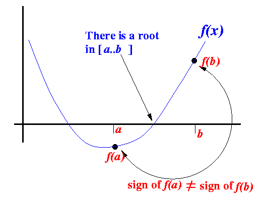
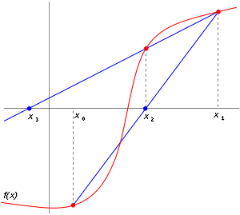
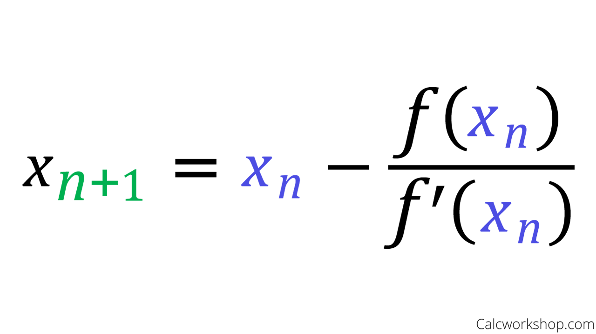

# Numerical Methods in Python


# Solving for Roots of Equations

## The problem

When finding the *root of a non-linear function*, 
the goal is to find a parameter input that returns 
a value of zero from that function. 
It is common notation to refer to the parameter as ```x``` 
and the function as ```f(x)``` or to solve for ```x``` 
such that ```f(x) = 0```. 
The parameter ```x``` can be a vector 
and there can be multiple solutions, depending on the function. 
The quadratic formula is the closed-form solution
to the problem of finding a root of ```f(x, a, b, c) = a*x**2 + b*x + c == 0```.
Solving a system of linear equations 
is also a root-finding problem: 
it solves for the root ```x``` of ```f(x) = A.dot(x) - b == 0```. 
Solving linear equations, however, is a much more simple problem
because the slope of the function is constant. 
There is one more element of complexity when the function is nonlinear:
the behavior of the function at one location does not necessarily
describe the properties at other locations. 
You may have to try several approaches to find the solution. 


## The solution

There are several algorithms for finding the root of a function 
and the following selection illustrates the nature of the solution and the type of situation in which it applies. 

### Grid Search

While not favored in terms of computational expense, 
one approach is to calculate a vector of values. 
Then, choose the value closest to zero. 

```python
# Define function.
def quad_fn(x, a, b, c):
    # Note that this calculation also operates on vectors. 
    f = a*x^2 + b*x + c
    return(f)

a = 1/4
b = 1 
c = -1

# Calculate function values across a grid of values of x.
import numpy as np
x_grid = np.arange(-10, 5, 0.01)
f_grid = quad_fn(x_grid, a, b, c)
```

It is often very helpful to plot the function to get an idea of where the root might be located.

```python
plt.figure()
plt.plot(x_grid, f_grid, label='f(x)' )
plt.plot(x_grid, 0*f_grid)
plt.xlabel('x')
plt.ylabel('f(x)')
plt.show()
```

From the plot, we can see that there are two roots, 
one near -5 and the other near 1 and 2. 
We can select the value of ```x``` such that 
the absolute value of ```f(x)``` is minimized, 
using the ```np.argmin()``` method 
and ```abs()``` function in ```Python```. 

```python
# The closest to zero has the lowest abosolute value.

# The argmin() numpy method finds the index number of the minimal value.
abs_f_grid = abs(f_grid)
x_root_index = abs_f_grid.argmin()
x_root_1 = x_grid[x_root_index]

print(x_root_1)
```

You can verify that this is actually a root
by plugging it back in to the function.
```python
print(quad_fn(x_root_1, a, b, c))
```

If it is a root it is close to zero. 
You can get a more accurate calculation by 
using a narrower interval with a larger step size.

```python
# Do it again with a higher resolution.
x_grid = np.arange(0, 1, 0.0001)
f_grid = quad_fn(x_grid, a, b, c)

# All in one line:
x_root_2 = x_grid[abs(f_grid).argmin()]

print(x_root_2)
print(quad_fn(x_root_2, a, b, c))
```

This approach is fairly foolproof but it is limited in scope because it is 
computationally expensive to evaluate the function at all candidate values
and the accuracy is limited by the step size between grid points. 
Other approaches are designed to take fewer steps to approach roots using information from more than one point at a time. 


### Bisection Method

A common approach is the bisection method, in which the algorithm bisects an interval to progress to a subinterval that should contain a root.
It continues recursively, selecting smaller and smaller subintervals, up to 
the required degree of accuracy. 
In order for this algorithm to work, the function ```f(x)``` must be continuous and the first iteration has to be initialized such that ```f(x)``` has a different sign at each of the initial endpoints. 




For example, we can use the bisection method to
find the root of this function.

```python
def f(x):
    f_out = math.log(x) - math.exp(-x)
    return f_out
```
Initialize the algorithm with two values on either side of 
the horizontal axis.

Since we know the log function is zero when x = 1, 
we can choose initial values on each side of 1. 

```python
a_1 = 0.25
b_1 = 2.5
```

Just to be sure, let's verify that these points 
place the function on either side of zero.

```python
print(f(a_1))
# -2.1650951441912953

print(f(b_1))
# 0.8342057332502563
```


The algorithm begins by evaluating ```f(x)``` at the midpoint and then replacing the endpoint of the same sign with the midpoint, creating an interval of half the width that contains the root. 


```python
Now take the midpoint.
m_1 = (a_1 + b_1)/2
```

Evaluate the function at the midpoint to see the sign. 

```python
print(f(m_1))
# 0.06561413531378812
```

This is much closer (but that doesn't have to be the case).
Since this value is positive, use ```m_1``` to replace ```b_1``` 
in the next iteration.


```python
a_2 = a_1
b_2 = m_1
```
Again, take the midpoint and evaluate the function 
at the midpoint to see the sign. 


```python
m_2 = (a_2 + b_2)/2

print(f(m_2))
# -0.6513866748593243
```

Now function is negative at the midpoint, 
so ```m_2``` should replace the lower endpoint ```a_2```.

```python
# Take another iteration.

a_3 = m_2
b_3 = b_2

m_3 = (a_3 + b_3)/2

print(f(m_3))
```

  It becomes more accurate to several decimal places
after a few more iterations.


```python
a_4 = m_3
b_4 = b_3
m_4 = (a_4 + b_4)/2
print(f(m_4))
# -0.08045182180248231
```
...closer...
```python
a_5 = m_4
b_5 = b_4
m_5 = (a_5 + b_5)/2
print(f(m_5))
# -0.005293741207889502
```
...closer...
```python
a_6 = m_5
b_6 = b_5
m_6 = (a_6 + b_6)/2
print(f(m_6))
# 0.03066641752381105
```

Although the result of this particular iteration is not closer 
than the last one, we know that the interval has 
width ```(b-a)/2**6```, or ```0.03515625```, 
so this is an upper bound on the distance from the root.
On any particular iteration ```i```, the root could be close to 
either ```a_i```, ```b_i```, or ```m_i```. 


The algorithm proceeds until the desired number of iterations are performed. 
This approach is reliable but is also fairly expensive to execute because it 
moves slowly taking steps of a predetermined length. 

### Secant Method

A root-finding algorithm can be made more efficient if it takes advantage of the slope of the function. 
One method that does this is the secant method. 
It works by taking a secant line, the line that connects two points on the function, and taking the next step to the root of this line, which can be solved easily. 
The calculation proceeds as follows.


Graphically, the algorithm is initialized with two points, ```x_0``` and ```x_1``` 
and calculates the next candidate for a root at ```x_2```. 
Proceeding to use the pair of points ```x_1``` and ```x_2```, 
the algorithm next predicts ```x_3``` as a root. 
Although, in this example, ```x_3``` is further from the root, 
it allows a close approximation in the next iteration 
using points ```x_2``` and ```x_3``` for the next secant line. 



The following function solves for the root of the function ```f(x)``` above. 

```python
def secant_root_f(x0, x1, tol, num_iter):
    """Solves for the root of the function f(x)
    using the secant method.
    
    """
    
    for i in range(num_iter):
        
        x2 = x1 - f(x1)*(x1-x0)/(f(x1)-f(x0))
        print(i)
        print(f(x2))
        if (abs(f(x2)) < tol):
            return x2
        x0 = x1
        x1 = x2
        
    # If it reaches the end of the loop, it has
    # exceeded the maximum number of iterations.
    print("Exceeded allowed number of iterations")
    return None
```

Note that this function requires four arguments.
The first two are the initial values of ```x```
for the first secant line. 
The next two determine when the algorithm ends: 
either the algorithm reaches a value of ```f(x_2)``` 
less than tolerance ```tol```, 
or the algorithm performs ```num_iter``` iterations. 
The second condition is to prevent the algorithm from continuing
too long (or forever!).


Let's apply this method to the function above:

```python
x_root = secant_root_f(1, 2, 10**(-7), 4)
print(x_root)
Exceeded allowed number of iterations
None
```

We'll have to try it with more iterations.

```python
x_root = secant_root_f(1, 2, 10**(-7), 100)
print(x_root)
# 1.3097995826147546
```

Now test it at that candidate value for the root, to make sure.

```python
print(f(x_root))
# -3.295761330512903e-09
```

That's close enough for me. 
If you want a more accourate root, use a smaller ```tol```
(and possibly a larger value of ```num_iter```).


### Newton's Method

Newton's method (often called the Newton-Raphson method, 
with due credit given to Joseph Raphson) uses calculus 
to get a more accurate measurement of the slope 
at a given point on the function. 
It chooses the next candidate point by solving for 
the root of the tangent line at the current point. 
The solution of this linear equation is represented 
by the following recurrence relation. 



Graphically, the first step looks as follows. 


The iterations continue until the desired accuracy level is achieved. 


In order to use Newton's method, we will need another function
to calculate the derivative of ```f(x)```, which we will call ```f_prime(x)```.

```python
def f_prime(x):
    diff_out = 1/x + math.exp(-x)
    return diff_out
```

The following function solves for the root of the function ```f(x)``` above. 

```python
def newton_root_f(x0, tol, num_iter):
    """Solves for the root of the function f(x)
    using Newton's method.
    """
    x_i = x0
    for i in range(num_iter):
        
        x_i = x_i - f(x_i)/f_prime(x_i)
        if (abs(f(x_i)) < tol):
            return x_i
        
    # If it reaches the end of the loop, it has
    # exceeded the maximum number of iterations.
    print("Exceeded allowed number of iterations")
    return None
```

Let's apply this method to the function above:

```python
x_root = newton_root_f(1, 10**(-7), 4)
print(x_root)
# 1.3097995858041345
```

It worked on only 4 iterations. 
Typically, Newton's method is faster than many other alternative methods
but there's a catch: you have to know how to calculate the derivative
(and that the derivative exists!). 


## Solving Nonlinear equations with Python Modules

Now that we have seen what is going on under the hood, 
we can appreciate what kinds of things are going on in the 
modules already available. 
We can do everything we have done above
but also handle more complex problems. 


### Single variable equations

We'll start by continuing with the single variable problem. 
As above, the goal is to find the root of this function.

```python
def f(x):
    out_value = math.log(x) - math.exp(-x)
    print("(x, f(x)) = (%f, %f)" % (x, out_value))
    return out_value
```

That is, to find the x at which this function is zero.

Note that this function unnecessarily prints
the value of x and f(x) to demonstrate the progress. 

Again, it helps to know where to look. 
Plot the function first to show an approximate root.


```python
x_grid = np.arange(0.1, 2, 0.01)
f_grid = x_grid*0
for i in range(0, len(x_grid)):
    f_grid[i] = f(x_grid[i])


plt.figure()
plt.plot(x_grid, f_grid, label='f(x)' )
plt.plot(x_grid, 0*f_grid)
plt.xlabel('x')
plt.ylabel('f(x)')
plt.show()
```

The following function is a "legacy solution", in that 
it uses a function definition fslove()
that is no longer in use.

```python
soln_fs = fsolve(f, 1)
# The root:
print(soln_fs)
# The objective function:
print(f(soln_fs))
```

I show it because it might appear after a web search 
and because it is conceptually simple. 


The functions for other legacy functions include
the following:

```python
soln_b1 = broyden1(f, 1)
soln_b1 = broyden2(f, 1)
soln_b1 = anderson(f, 1)
```

These are named after the mathematicians
and computer scientists who devised the algorithms. 
Modern Python functions no longer have these names
but they may call the algorithms with these names.

### Multiple variable equations


Here is an example of a set of nonlinear equations 
with 2 equations and 2 parameters.


```python
def my_eqns_22(x):
    F1 = x[0]**2+ x[1]**2 - 1 
    F2 = x[0]**2- x[1]**2 + 0.5
    return [F1, F2]
```

Try a few test values to test it for a few inputs. 
We can use these as starting values for a root-finding algorithm.

```python
my_eqns_22([1, 1])

my_eqns_22([1, 2])
```

Start the algorithm at a sensible value by choosing the value 
that is closer to zero already.

```python
x0 = [1, 1]

soln_m_22 = optimize.root(my_eqns_22, x0)
```

Print out the root and the value of the system of equations.

```python
# The root:
print(soln_m_22.x)
# The objective function:
print(soln_m_22.fun)
print(my_eqns_22(soln_m_22.x))
```

Now let's solve this system of nonlinear equations
with 3 equations and 2 parameters.


```python
def my_eqns_32(x):
    F1 = x[0] + x[1] + x[2]**2 - 12
    F2 = x[0]**2 - x[1] + x[2] - 2
    F3 = 2 * x[0] - x[1]**2 + x[2] - 1
    return [F1, F2, F3]
```


Agiain, test it for a few inputs (potential starting values) first.


```python
my_eqns_32([1, 1, 1])

my_eqns_32([0, 0, 0])

x0 = [1, 1, 1]

soln_m32_1 = optimize.root(my_eqns_32, x0)
```

Verify the solution.

```python
# The root:
print(soln_m32_1.x)
# The objective function:
print(soln_m32_1.fun)
print(my_eqns_32(soln_m32_1.x))
```


Try the other starting value, just to compare.

```python
x0 = [0, 0, 0]

soln_m32_2 = optimize.root(my_eqns_32, x0)

# The root:
print(soln_m32_2.x)
# The objective function:
print(soln_m32_2.fun)
print(my_eqns_32(soln_m32_2.x))
```

Many of these algorithms are robust to different starting values
but that mostly depends on the properties of 
the equations that you are solving. 
It works best, as in it is most likely to succeeed
and do so in fewer iterations, 
if you start from a value that is close toi a root. 


## Passing additional parameters. 

Some systems of equations depend on other fixed parameters. 
In this example, we can solve for the vector ```x```, 
holding ```parms``` fixed at given values.

```python
def my_eqns_33_p(x, parms):
    F1 = x[0] + x[1] + x[2]**2 - parms[0]
    F2 = x[0]**2 - x[1] + x[2] - parms[1]
    F3 = 2 * x[0] - x[1]**2 + x[2] - parms[2]
    return [F1, F2, F3]
```

You can solve for these as above, 
except that you pass the extra parameters to ```optimize.root()```. 

```python
# Set parameters and choose starting values.
parms = [12, 2, 1]
my_eqns_33_p([1, 1, 1], parms)
x0 = [1, 1, 1]


# Solve
soln_m33_p = optimize.root(my_eqns_33_p, x0, parms)

# The root:
print(soln_m33_p.x)
# The objective function:
print(soln_m33_p.fun)
print(my_eqns_33_p(soln_m33_p.x, parms))
```


As above, try other parameters and starting value.

```python
parms = [24, 4, 2]
x0 = [0, 0, 0]
my_eqns_33_p(x0, parms)

# Solve
soln_m33_p = optimize.root(my_eqns_33_p, x0, parms)

# The root:
print(soln_m33_p.x)
# The objective function:
print(soln_m33_p.fun)
print(my_eqns_33_p(soln_m33_p.x, parms))
```

Sometimes you can chance upon a different solution. 

```python
# Test these values:
x0 = [-0.6406658, 1.2471383, 4.8366856]
my_eqns_33_p(x0, parms)
# Another solution. 

# Solve to higher degree of precision.
soln_m33_p = optimize.root(my_eqns_33_p, x0, parms)

# The root:
print(soln_m33_p.x)
# The objective function:
print(soln_m33_p.fun)
print(my_eqns_33_p(soln_m33_p.x, parms))
```

There is often more than one solution to a system of 
nonlinear equations. 
There is, in general, no way to control which root you find, 
so you have to know your function to know where to look. 

