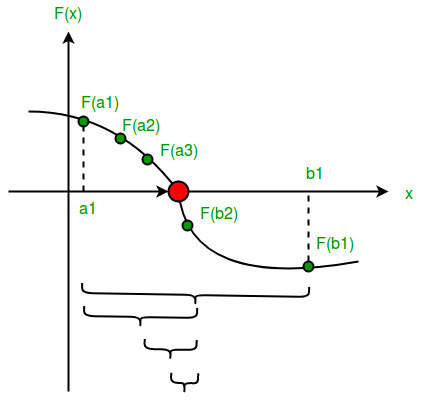
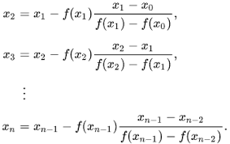
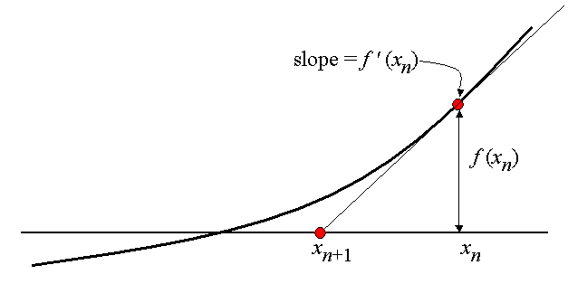

# Numerical Methods in Python


## Solving for Roots of Equations

### The problem

When finding the *root of a non-linear function*, the goal is to find a parameter input that returns a value of zero from that function. 
It is common notation to refer to the parameter as ```x``` and the function as ```f(x)``` or to solve for ```x``` such that ```f(x) = 0```. 
The parameter ```x``` can be a vector and there can be multiple solutions, depending on the function. 
Technically speaking, solving a system of linear equations can also be thought of as a root-finding problem: it solves for the root ```x``` of ```f(x) = A %*% x - b = 0```. 
There is one more element of complexity when the function is nonlinear. 

### The solution

There are several algorithms for finding the root of a function and the following selection illustrates the nature of the solution and the type of situation in which it applies. 

#### Grid Search

While not favored in terms of computational expense, one approach is to calculate a vector of values. 


```
# Define function.
quad_fn <- function(x, a, b, c) {
    # Note that this calculation also operates on vectors. 
    f <- a*x^2 + b*x + c
    return(f)
}
a <- 1/4
b <- 1 
c <- -1
# Calculate function values across a grid of values of x.
x_grid <- seq(-10, 5, by = 0.01)
f_grid <- quad_fn(x_grid, a, b, c)
```

It is often very helpful to plot the function to get an idea of where the root might be located.

```
plot(x_grid, f_grid, type = 'l', col = 'blue', 
    main = 'Plot of f(x) = quad_fn(x_grid, a, b, c)', 
    xlab = 'x', ylab = 'f(x)')
abline(h = 0)
```

From the plot, we can see that there are two roots, one near -5 and the other near 1 and two. 
We can select the value of ```x``` such that the absolute value of ```f(x)``` is minimized, using the ```which.min()``` and ```abs()``` functions in ```R```. 

```
x_root <- x_grid[which.min(abs(f_grid))]
print(x_root)
```

This approach is fairly foolproof but it is limited in scope because it is 
computationally expensive to evaluate the function at all candidate values
and the accuracy is limited by the step size between grid points. 
Other approaches are designed to take fewer steps to approach roots using information from more than one point at a time. 


#### Bisection Method

A common approach is the bisection method, in which the algorithm bisects an interval to progress to a subinterval that should contain a root.
It continues recursively, selecting smaller and smaller subintervals, up to 
the required degree of accuracy. 
In order for this algorithm to work, the function ```f(x)``` must be continuous and the first iteration has to be initialized such that ```f(x)``` has a different sign at each of the initial endpoints. 


The algorithm proceeds by evaluating ```f(x)``` at the midpoint and then replacing the endpoint of the same sign with the midpoint, creating an interval of half the width that contains the root. 



The algorithm proceeds until the desired number of iterations are performed. 
This approach is reliable but is also fairly expensive to execute because it 
moves slowly taking steps of a fixed length. 

#### Secant Method

A root-finding algorithm can be made more efficient if it takes advantage of the slope of the function. 
One method that does this is the secant method. 
It works by taking a secant line, the line that connects two points on the function, and taking the next step to the root of this line, which can be solved easily. 
The calculation proceeds as follows.



Graphically, the algorithm is initialized with two points, ```x_0``` and ```x_1``` and calculates the next candidate for a root at ```x_2```. 
Proceeding to use the pair of points ```x_1``` and ```x_2```, the algorithm next predicts ```x_3``` as a root. 
Although ```x_3``` is further from the root, it allows a close approximation in the next iteration using points ```x_2``` and ```x_3``` for the next secant line. 


#### Newton's Method

Newton's method (often called the Newton-Raphson method, with due credit given to Joseph Raphson) uses calculus to get a more accurate measurement of the slope at a given point on the function. 
It chooses the next candidate point by solving for the root of the tangent line at the current point. 
The solution of this linear equation is represented by the following recurrence relation. 


Graphically, the first step looks as follows. 



The iterations continue until the desired accuracy level is achieved. 


### Examples

The ```uniroot``` function in ```R``` uses the bisection method to solve for a root of a univariate function, i.e. with one-dimensional ```x```. 

```
# Define the function.
# Goal: Find the root of this function.
f <- function(x) log(x) - exp(-x)
# That is, find the x at which this function is zero.

x_grid <- seq(0.1, 2.0, by = 0.01)
plot(x_grid, f(x_grid),
     main = 'Finding a Root',
     xlab = 'x', ylab = 'f(x)',
     col = 'blue', type = 'l')
abline(h = 0)

# Solution:
f_soln <- uniroot(f, c(0, 2), tol = 0.0001)
f_soln
```

In Python, the ```Brent``` algorithm serves a similar purpose and also applies to a single-variable problem. 

```

```

For more flexible algorithms see the folowing examples that take advantage of the information contained in the slope of the function. 
It is especially useful for speeding up calculations in a multi-variable problem. 
The ```multiroot``` function in the ```R``` package ```rootSolve``` uses the Newton-Raphson method. 


```
# Define a multivariate function.
model_2 <- function(x) {

  F1 <- x[1]^2+ x[2]^2 -1
  F2 <- x[1]^2- x[2]^2 +0.5

  return(c(F1 = F1, F2 = F2))
}

# Test it at some values of x.
model_2(x = c(1, 2))
model_2(x = c(1, 1))
# Use this to get an idea of where to satrt.

# Obtain the root with multiroot.
soln_2 <- multiroot(f = model_2, start = c(1, 1))

# Verify that the solution is a root.
> model_2(x = soln_2$root)
          F1           F2 
2.323138e-08 2.323308e-08 
# Close to zero (numerically).
```


```

```


