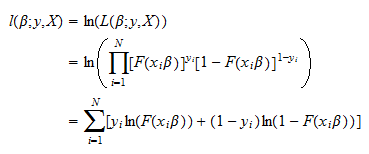
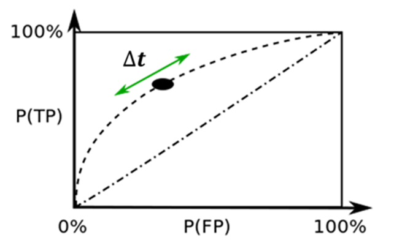
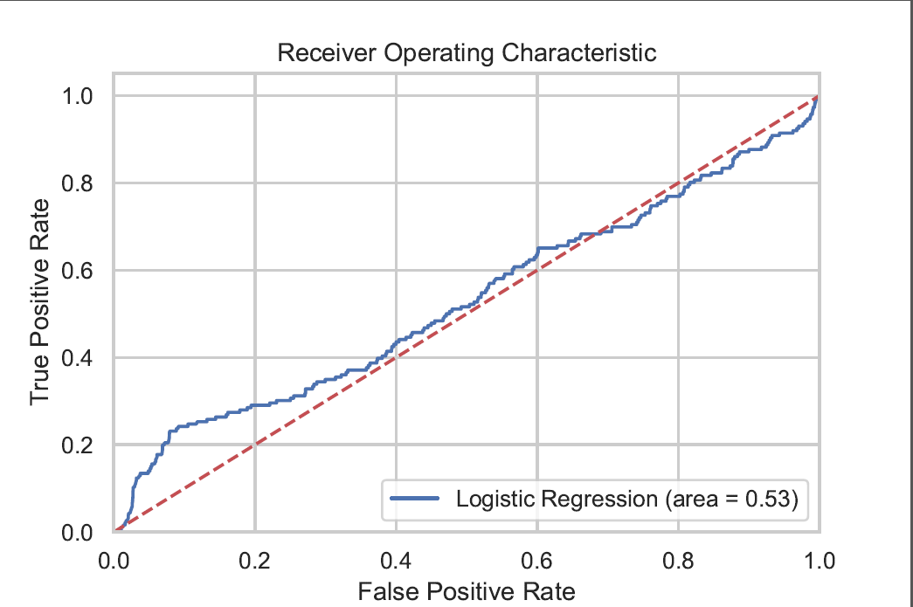

# Classification in Python

Recall the quick introduction to the concept of regression analysis
in a previous demonstration. 
We will extend it by considering the problem of classifying observations, 
that is, sorting observations into categories. 

## Linear Regression 

Linear regression is a statistical method for obtaining a prediction of an outcome 
 
from an observed variable.

### The Regression Equation


The prediction takes the form of a linear equation for the prediction of 
 
as a linear combination of the variables

multiplied by the parameter
, 
plus an intercept
.


### The Minimization Problem

The parameters 
 
and

are estimated by minimizing the sum of squared residuals from the regression line defined by
 
and
.
The residuals are the differences from the observed values 
 
from the values predicted by the regression line. 


### Estimating a Linear Regression in Python

Estimating a linear regression in R involves three main steps.
1. Reading in the data.
1. Specifying the regression equation.
1. Calculating the statistics for the regression model.


As above, you can read in the data with the ```read_csv``` from the ```pandas``` module for data analysis. 

```
import pandas as pd
my_data = pd.read_csv('name_of_my_data_set_file.csv')
```

Much like the ```lm``` function in R 
(which you might encounter in an econometrics course), 
you pass the dataset and the fornula to the ```ols``` method in the ```statsmodels``` module. 
```
import statsmodels.formula.api as sm
reg_model_sm = sm.ols(formula = "Y ~ X_1 + X_2 + X_3", data = my_data).fit()
```


The results of the regression are stored in the object ```reg_model_sm```. 
You can print out the regression results by summarizing ```reg_model_sm``` which was created by the ```ols``` method.
This is done by using the ```summary``` method for that object. 


```
# Display a summary table of regression results.
print(reg_model_sm.summary())

```


### The Fit of a Regression Model

The quality of fit of a regression model is determined by the degree to which the observations fit close to the regression line. 
It is represented by the statistic 
, 
pronounced "R-squared."
This statistic ranges from 
, 
for a model that fits the data perfectly,
to 
, 
if the dependent variable 

is unrelated to the explanatory variable
.
This statistic is shown in the regression output under the headings
```R-squared``` and ```Adj. R-squared```.
Again, the ```Adj. R-squared``` includes an adjustment, or penalty, to account for the number of variables in the model, because
the ```Adj. R-squared``` can only be improved by including more variables in the model. 


For logistic regression, the concepts are similar 
but the nature of the problem is different, 
so the particular calculations must be modified. 


## Logistic Regression

First we will consider the simplest classification problem:
binary classification. 
When the variable takes the form of a binary variable, i.e., it takes on only two values, say, 0 and 1, the linear regression model is not appropriate. 
The logistic regression model uses the logistic transformation to produce an estimate of the probability that 
.

### The Logistic Equation

The logistic equation also implies that the data are a transformation of a linear equation in

by applying the *logit* transformation. 
This transformation defines the probability of a random event in terms of 
the *log-odds ratio*. 
It is what it sounds like: calculate the *odds ratio*, 
which is the ratio of the probability that

to the probability that
. 

You can apply the following operations to the linear equation for 
the logistic regression model to solve for the probabilites. 


This set of operations produces the logit link function
that calculates probabilities (in the bottom line) 
from a linear statistical model (in the top line). 


### The *Maximization* Problem

The probabilities calculated from the parameters a and b are applied
to each observation in the sample to calculate the likelihood of
observing the entire sample. 
This is done by taking the product of the probabilities of each observation, 
which is P, if 

and (1-P) if 
. 
To consolidate the parameters into a single vector, 
we will use a vector 
, 
which contains the intercept ```a``` and slope ```b```, now called
 
and

in what follows. 

The parameters 
 
and

are estimated by *maximizing* the likelihood function 
from the logistic transformation of the regression line defined by
 
and
.

In this more general form, the value P is represented by the 
Cumulative Density Function (CDF), denoted ```F()```:





We take the logarithmic transformation above 
because it does not change the maximum, 
since it is a monotonic transformation, 
but it helps us rearrange the likelihood function 
into a simpler form. 


### Comparison with Linear Probability Model


The prediction from a linear regression is called the *linear probability model* when it is used to predict binary events. 
Compared to the linear probability model, the logistic regression produces estimates of the probabilities that are constrained to lie between zero and one, as they should. 
In contrast, the predictions from the linear probability model will be greater than one and lower than zero for some values of 
.


### Estimating a Logistic Regression in Python

Estimating a logistic regression in Python involves the same three steps as
for a linear regression model.
1. Reading in the data.
1. Specifying the regression equation.
1. Calculating the statistics for the regression model.

As above, you can read in the data with the ```read_csv``` from the ```pandas``` module for data analysis. 

```
import pandas as pd
my_data = pd.read_csv('name_of_my_data_set_file.csv')
```


Then pass these two arguments to the ```Logit``` method in the ```statsmodels``` module, imported above. 
First, select the columns for the explanatory variables (all but the first column).

```
# Get names of explanatory variables
X_cols = credit.columns[1:]

```
The model object has to be initialized first, and the model is calculated with the ```fit()``` method in the ```logit_model_sm``` object. 

```
# Initialize and specify the logistic model.
logit_model_sm = sm.Logit(credit['default'], credit[X_cols])

# Fit the model.
logit_model_fit_sm = logit_model_sm.fit()

```


The results of the regression are stored in the object ```logit_model_fit_sm```. 
As with a linear regression, you can print out the regression results by summarizing the model object ```logit_model_fit_sm``` that was created by the ```fit()``` method.


```
# Display a summary table of regression results.
print(logit_model_fit_sm.summary())
```


### The Fit of a Logistic Regression Model

Another method is used to measure the quality of fit of a logistic regression model. 
A statistic called the *Area under the ROC Curve* is appropriate for this. 
The *AUROC* is interpreted as the probability that any pair of predictions is correctly ordered, when one observation is drawn from 

and one is drawn from
, 
where "correctly ordered" means that the prediction for the probability that

is higher than the prediction for the probability that
.

Although it is quite commonly used in industry, 
this statistic is not automatically printed out with the model output. 
You can calculate it separately as follows. 
It requires importing specific functions from the ```sklearn.metrics``` module.

```
# Calculate the values required for an ROC curve.
from sklearn.metrics import roc_auc_score
from sklearn.metrics import roc_curve
# logit_roc_auc = roc_auc_score(y, logit_model_fit_sk.predict(X))
logit_roc_auc = roc_auc_score(y, logit_model_fit_sk.predict_proba(X)[:,1])

```

The ROC curve takes the observations sorted by predicted porbability
and plots the true positive rate against the false positive rate. 
An example of the ROC curve is shown here:




The higher the curve, the higher the area, the better the predictive model. 
Aline near the 45 degree line indicates a poor fit, 
with a prediction about as good as guessing randomly. 

In reality, the curve will be more noisy.
In the example in our demo, 
modeling the probability that a borrower will default on a loan, 
the ROC curve looks like this:



This result is somewhat disappointing but
it shows where the model works and where it doesn't. 
There is an increase over the left part of the curve, 
for the customers with high probabilities of default. 
For those less likely to default, the curve is near the 45 degree line. 
This indicates that the model is better able to distinguish 
between risky borrowers but not so good at separating less risky borrowers.

