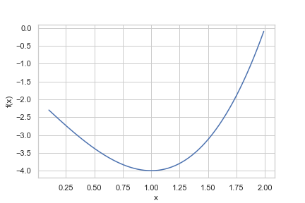
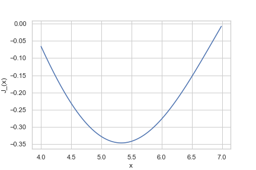

# Numerical Methods in Python


# Optimization

## The problem

Solving an *optimization problem* involves finding a parameter input that 
achieves the maximum or minimum value of a particular *objective funtion*.
The problem is similar in nature to the root-finding problem, except that 
the objective is to search for a root of the derivative of the function.
An optimum will be located where the function is flat, that is, 
where the slope of the function is equal to zero.

## The solution

### Grid Search

We've tried this approach a number of times before:
loop over a range of possible values and choose the point
at which the objective function is highest or lowest. 
As with root-finding, it is computationally expensive 
but it is foolproof and will usually find an answer that is
"close enough." 

Recall this exercise posed earlier. 
We were maximizing a consumer's utility subject to a budget constraint. 
There were two approaches:
1. Loop over goods x and y and record the point with the highest utility, 
considering only those points that satisfy the constraint. 
2. Loop over good x only and impose the constraint to determine the optimal y as a function of x. 

An abridged version of the first approach looks like this:

```python
def two_loop_bundle(p_x: float, p_y: float, w: float, alpha: float, 
                    step: float) -> float:
    """
    Calculates the consumer's optimal bundle of goods
    for a consumer with Cobb-Douglass utility function.
    It searches over two loops on x_star and y_star.
    """
    
    # Define grid of parameters for search.
    x_star_list = np.arange(0, w/p_x, step)
    y_star_list = np.arange(0, w/p_y, step)
    
    # Initialize util and indices.
    max_util = -1
    i_max = None
    j_max = None
    
    # Loop over candidate values to find a minimum SSR.
    for i in range(len(x_star_list)):
        for j in range(len(y_star_list)):

            # Extract candidate values of parameters.
            x_i = x_star_list[i]
            y_j = y_star_list[j]
            
            # Calculate candidate value of utility function.
            util_ij = utility(x_i, y_j, alpha)
            
            # Determine whether this combination of
            # x_i and y_j satisfies the budget constraint. 
            util_in_budget = in_budget(x_i, y_j, p_x, p_y, w)
            
            # Replace values if util_ij is a new high.
            if util_ij > max_util and util_in_budget:
                # Keep this as the new highest value.
                max_util = util_ij
                # Record the location of the parameter values.
                i_max = i
                j_max = j
                
    # At the end output the highest values.
    return [x_star_list[i_max], y_star_list[j_max]]

```

Notice the condition 
```python
util_in_budget = in_budget(x_i, y_j, p_x, p_y, w)
```
which imposed the budget constraint by ruling out bundles of x and y
that are out of bounds by with the boolean variable ```util_in_budget``` 
in the condition
```python
util_ij > max_util and util_in_budget
```
thereby ruling them out of 
consideration for the optimum. 

In the second approach, we work out on paper what the budget constraint
imposes on y for any value of x, thereby reducing the dimension of the problem. 

```python
def one_loop_bundle(p_x: float, p_y: float, w: float, alpha: float, 
                    step: float) -> float:
    """
    Calculates the consumer's optimal bundle of goods
    for a consumer with Cobb-Douglass utility function.
    It searches over a loop on x_star and assigns the remaining
    wealth to y using y_solve.
    """
      max_util = -1
      x_star = None
      y_star = None
      
      x_star_list = np.arange(0, w/p_x, step)
      
      for i in range(len(x_star_list)):
          x_i = x_star_list[i]
          y_i = y_solve(x_i, p_x, p_y, w)
          util_i = x_i**alpha * y_i**(1 - alpha)
          
          if util_i > max_util:
              x_star = x_i
              y_star = y_i
              max_util = util_i
              
      return [x_star, y_star]

```

Here, the line ```y_i = y_solve(x_i, p_x, p_y, w)``` 
determines the value of y, without wasting time
looking at values of y that we know are not optimal, in combination with x. 
This is more efficient because we have removed the inner loop. 

It is still inefficient, however, 
because the algorithm does not prioritize where to look:
it spends equal computation time at all points on the grid. 
It doesn't adapt to the information gained at some points
to better decide where to look on the next iterations. 


### The Newton-Raphson Method

We have heard of the Newton-Raphson method, often called "Newton's method",
for solving roots of equations but it is also used for optimization. 
Given the description above, this shouldn't be surprising
because, again, the problem of optimization 
is closely related to the problem of solving for roots:
the optimum is at a point where the derivative is zero, 
i.e. it is the root of the slope of the objective function. 

Now consider Newton-Raphson method for optimization.
The idea behind this algorithm is the same as that for finding roots:
calculate a second-order approximation to the function at the current point
and then solve this approximation for its optimum.
The optimum of the approximation is used as the next step toward the optimum of the function.
The recurrence relation for the Newton-Raphson method is shown below for both the single-variable and multi-variable optimization problems.


Graphically, the algorithm proceeds as shown in the following two figures.
In the first case, it uses a series of quadratic approximations
to find a maximum. 


In the second, it uses a series of quadratic approximations
to find a minimum. 


## Example of the Algorithm

We will consider a univariate problem to illustrate the algorithm. 


## Examples using Python modules

### Univariate Optimization

We can do the above by using the function ```minimize_scalar```
in the ```scipy.optimize``` module. 
First, we need to define a function to optimize. 
For a quick way to define a function, we can use this notation:


```python
f = lambda x: (x - 2) * (x + 1)**2
```
The ```lambda``` works like ```def``` 
but it can be written in a single line
and it implicitly returns the value that comes after the colon. 

To visualize this function, it is a good idea to produce a plot:

```python
# Plot this function to show an approximate optimum.
x_grid = np.arange(0.1, 2, 0.01)
f_grid = x_grid*0
for i in range(0, len(x_grid)):
    f_grid[i] = f(x_grid[i])


plt.figure()
plt.plot(x_grid, f_grid, label='f(x)' )
plt.xlabel('x')
plt.ylabel('f(x)')
plt.show()
```



I had to guess the values for the range, 
which might take some trial and error
but the same is often true when using built-in algorithms. 
Here, we can see that there is an optimum near 1
with a value around -4. 

#### Unconstrained minimization: Brent Method

Now, we'll use the "Brent" method to optimize it without constraint. 
That is, it can search over any number, without us specifying where to look. 
```python
import numpy as np
import matplotlib.pyplot as plt

res_sc_br = minimize_scalar(f, method='brent')

print(res_sc_br.x)
print(res_sc_br.fun)
print(f(res_sc_br.x))

1.0
-4.0
-4.0
```
It does find an optimum at x = 1.0, where the function has value -4.
The third print statement verifies the optimum by plugging in the 
optimal ```x``` into the function ```f```.
This is not surprising because the function is quadratic
and we could have found the solution on paper. 

#### Bounded method: Need to specify an interval. 

Now let's try another approach by specifying an interval
in which to look for an optimum. 
This time, we will use a function for which we cannot calculate
the optimum by hand. 
It is called the "Bessel J" function (whatever that is).

```python
from scipy.special import j1
# Plot this function to show an optimum.
x_grid = np.arange(4, 7, 0.01)
f_grid = x_grid*0
for i in range(0, len(x_grid)):
    f_grid[i] = j1(x_grid[i])


plt.figure()
plt.plot(x_grid, f_grid, label='J_1(x)' )
plt.xlabel('x')
plt.ylabel('J_(x)')
plt.show()
```



This mysterious function has a minimum somewhere between 5 and 5.5
and has a minimum around -0.35. 
Now we need a computer package to find the optimum. 
Let's use the ```minimize_scalar``` function again bu this time, 
we'll tell it to look over an interval. 

```python
# Search for good bounds first:
j1(4)
j1(5)
j1(7)
```

```python
res_sc_bdd = minimize_scalar(j1, bounds=(4, 7), method='bounded')

print(res_sc_bdd.x)
print(res_sc_bdd.fun)
print(j1(res_sc_bdd.x))

5.3314418424098315
-0.3461262018536468
-0.3461262018536468
```

This confirms what we inferred from the plot, 
except it finds the minumum upt to many more digits of accuracy. 


Now let's try to break it:
we will give it an interval that we know *does not* 
contain the optimum and see what happens:

```python
res_sc_bdd_wrong = minimize_scalar(j1, bounds=(4, 5), method='bounded')

print(res_sc_bdd_wrong.x)
print(res_sc_bdd_wrong.fun)
print(j1(res_sc_bdd_wrong.x))

4.999994039139013
-0.32757846948655484
-0.32757846948655484
```

It gives a different answer. 
It finds the value of ```x``` that gives the highest value of ```J(x)``` 
*within the interval*. 
In this case, it is just inside the upper boundary at 5.0. 
If you are looking for a *global* minimum, thos would be the wrong answer. 
But it *is* the right answer to a different question:
Where is the lowest value of ```J(x)``` *within the interval (4, 5)*?


## Optimization in Regression Models

As mentioned earlier, in the linear regression model, 
the objective is to find the value of the coefficients 
that minimize the sum of squared errors.
Similarly, in the logistic regression model, 
the objective is to find the value of the coefficients 
that maximize the likelihood of the sample.
This solution differs for the logistic regression model in that 
it is no longer possible to reduce the problem 
to a system of linear equations: 
it is inherently a nonlinear problem.
However, the solution is not as different as one might imagine, 
since the intermediate steps are very similar 
as the algorithm approaches the solution by iteration.
In fact, in each step of the multivariate optimization 
with the Newton-Raphson method, 
the step is calculated by solving a linear system of equations 
at each step, just as you would for the linear regression model.
In fact, the algorithm is identical, except that the optimum
is reached in the linear regression model in one Newton step, 
because the sum of squared residuals *is* a quadratic function. 
