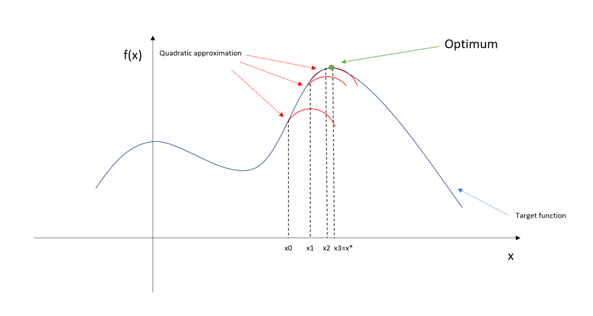

# Numerical Methods in Python


## Optimization

### The problem

Solving an *optimization problem* involves finding a parameter input that achieves the maximum or minimum value of a particular objective funtion.
The problem is similar in nature to the root-finding problem, except that the objective is to search for a root of the derivative of the function.
An optimum will be located where the function is flat, that is, where the slope of the function is equal to zero.

### The solution

Now consider Newton-Raphson method for optimization.
The idea behind this algorithm is the same as that for finding roots:
calculate a second-order approximation to the function at the current point
and then solve this approximation for its optimum.
The optimum of the approximation is used as the next step toward the optimum of the function.
The recurrence relation for the Newton-Raphson method is shown below for both the single-variable and multi-variable optimization problems.


Graphically, the algorithm proceeds as shown in the following two figures.




### Examples

In ```R```, when solving a single-variable optimization problem,
the ```optimize``` function.

```
f <- function (x, a) (x - a)^2
xmin <- optimize(f, c(0, 1), tol = 0.0001, a = 1/3)

xmin
$minimum
[1] 0.3333333

$objective
[1] 0
```
COnsider the following example of a multivariate function,
calculated with the BFGS algorithm, a variant of Newton's method.

```
# The Rosenbrock "Banana" function is a good example.
f_banana <- function(x) {
  x1 <- x[1]
  x2 <- x[2]
  100 * (x2 - x1 * x1)^2 + (1 - x1)^2
}
# Supply the calculation of the gradient to improve optimization.
# Gradient means a vector of first derivatives.
gr_banana <- function(x) { ## Gradient of 'fr'
  x1 <- x[1]
  x2 <- x[2]
  c(-400 * x1 * (x2 - x1 * x1) - 2 * (1 - x1), # Dx_1
    200 *      (x2 - x1 * x1))# Dx_2
}

# Optimize the function itself.
optim(c(-1.2,1), f_banana)

# Optimize with vector of derivatives (the BFGS algorithm is a quasi-Newton method).
soln_banana <- optim(c(-1.2,1), f_banana, gr_banana, method = "BFGS")
```

As mentioned above, in the linear regression model, the objective is to find the value of the coefficients that minimize the sum of squared errors.
Similarly, in the logistic regression model, the objective is to find the value of the coefficients that maximize the likelihood of the sample.
This solution differs for the logistic regression model in that it is no longer possible to reduce the problem to a system of linear equations: it is inherently a nonlinear problem.
However, the solution is not as different as one might imagine, since the intermediate steps are very similar as the algorithm approaches the solution by iteration.
In fact, in each step of the multivariate optimization with the Newton-Raphson method, the step is calculated by solving a linear system of equations at each step.

