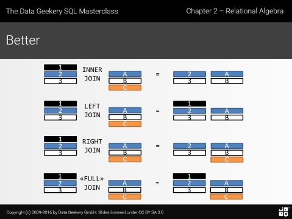
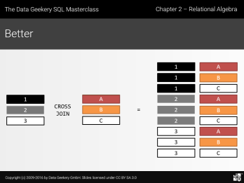

# Interacting with Databases Using SQL Scripts

Now that we know how to interact with a database, 
we will consider a few more examples. 
This time, we will progress toward a more generalized method of interacting
with databases: will will write SQL scripts. 
SQL is a language in its own right, so it makes sense 
to write your queries in dedicated SQL scripts. 
This way, the same operations can be used on a number of different platforms:
you could run them in the GUI of a database manager, 
you could submit them through a terminal window 
(such as when I run your my_module.py scripts), 
and you can read the text of the SQL query in Python 
and use the ```sqlite3``` module.

## Basic SQL Example

We'll start with a simple example before we get too far. 

### Operations on a single table

First specify the *schema* of the first table.
The *schema* is the list of specifications for the table, 
including the names of *fields* and the data types of the variables
in each field. 

```
CREATE TABLE FirstTable(
KeyID          INTEGER NOT NULL ,
Date           TEXT NOT NULL ,
Name           TEXT NOT NULL ,
PRIMARY KEY    (KeyID)
);
```

This query is saved in the SQL script ```Create_FirstTable.sql```. 
We can run it by reading the SQL code in the script as a string, 
then running it using the ```execute()``` method of our database connection, 
as if we entered the string manually. 

```python
import sqlite3

con = sqlite3.connect('example.db')
cur = con.cursor()

sql_str = open("Create_FirstTable.sql").read()
cur.execute(sql_str)

```


To verify the above, you can output the schema by using the command 

```python
cur.execute("PRAGMA table_info('FirstTable')").fetchall()

```

It ouputs the following:
```python
[(0, 'KeyID', 'INTEGER', 1, None, 1),
 (1, 'Date', 'TEXT', 1, None, 0),
 (2, 'Name', 'TEXT', 1, None, 0)]
```
The most important parameters at this stage are the names of the fields 
and the data types. 
Aside from checking for mistakes made on input, this is especially useful for understanding a database created by someone else. 

You can then populate ```FirstTable``` with a few entries as follows

```
INSERT INTO FirstTable(KeyID, Date, Name)
VALUES(1, "20131204", "Harry J. Paarsch");
INSERT INTO FirstTable(KeyID, Date, Name)
VALUES(2, "20131204", "Konstantin Golyaev");
INSERT INTO FirstTable(KeyID, Date, Name)
VALUES(3, "20131204", "Alberto M. Segre");
```

This information is recorded in the SQL script ```Populate_FirstTable.sql```.


```python
>>> sql_str = open("Populate_FirstTable.sql").read()
>>> cur.execute(sql_str)

```

This is the same set of commands we used to create the table 
but it throws an error:

```python
Traceback (most recent call last):

  File "<ipython-input-101-26fc28032745>", line 10, in <module>
    cur.execute(sql_str)

Warning: You can only execute one statement at a time.
```

The ```execute()``` method takes a string as the argument and
is designed to execute only one SQL statement. 
The right tool for the job is the ```executescript()``` method. 

```python
cur.executescript(sql_str)
```


To see the table entered above, you can execute the simplest SQL query
```python
>>> cur.execute('''SELECT * FROM FirstTable''')
>>> cur.fetchall()
[(1, '20131204', 'Harry J. Paarsch'),
 (2, '20131204', 'Konstantin Golyaev'),
 (3, '20131204', 'Alberto M. Segre')]
```
which will return the entire table. 

You can execute a query with a restriction by adding a ```WHERE``` clause

```python
>>> cur.execute("SELECT * FROM FirstTable WHERE KeyID > 1")
>>> cur.fetchall()
[(2, '20131204', 'Konstantin Golyaev'), (3, '20131204', 'Alberto M. Segre')]
```

Alternatively, you can execute a query with a projection by specifying the fields
```python
>>> cur.execute("SELECT Name, Date FROM FirstTable")
>>> cur.fetchall()
[('Harry J. Paarsch', '20131204'),
 ('Konstantin Golyaev', '20131204'),
 ('Alberto M. Segre', '20131204')]
```

If you prefer variables that are functions of the fields in the table, you can specify them with additional functions
```python
>>> cur.execute(
    "SELECT \
        Name ,\
        SUBSTR(Date, 1, 4) as Year \
    FROM FirstTable"
)
>>> cur.fetchall()
[('Harry J. Paarsch', '2013'),
 ('Konstantin Golyaev', '2013'),
 ('Alberto M. Segre', '2013')]
```

Notice that the backslash ```\```
allows a string to continue to the next line.

Finally, you can combine these operations in a more complex query

```python
>>> cur.execute(
    "SELECT \
        Name ,\
            SUBSTR(Date, 1, 4) as Year \
    FROM \
        FirstTable \
    WHERE KeyID > 1 \
"
)
>>> cur.fetchall()
[('Konstantin Golyaev', '2013'), ('Alberto M. Segre', '2013')]
```

### Combining more than one table

Again, first specify the schema of this table

```
CREATE TABLE SecondTable(
KeyID          INTEGER PRIMARY KEY ,
OtherID        INTEGER PRIMARY KEY ,
Name           TEXT NOT NULL ,
FOREIGN KEY    (OtherID) REFERENCES FirstTable (KeyID)
PRIMARY KEY    (KeyID)
);
```


Next populate ```SecondTable``` with a few entries as follows

```
INSERT INTO SecondTable(KeyID, OtherID, Name)
VALUES(101, 1, "Harry J. Paarsch");
INSERT INTO SecondTable(KeyID, OtherID, Name)
VALUES(102, 2, "Konstantin Golyaev");
```

Since we know how to execute an SQL script with multiple commands, 
we can create the table and populate it from one script. 

```python
sql_str = open("SecondTable.sql").read()
cur.executescript(sql_str)
```

Now you can verify the contents of the database by executing 
```PRAGMA table_info('SecondTable')``` or, 
for a small example such as this, you can output the table to screen

```python
>>> cur.execute('''SELECT * FROM SecondTable''')
>>> cur.fetchall()
[(101, 1, 'Harry J. Paarsch'), (102, 2, 'Konstantin Golyaev')]
```

With two tables, you can implement what is sometimes called a *theta join*. 
Theta is the Greek letter that is sometimes used to denote the operation
of combining tables. 

```python
>>> cur.execute(
    "SELECT \
        FirstTable.KeyID , \
        SecondTable.KeyID , \
        FirstTable.Name \
    FROM \
        FirstTable , \
        SecondTable \
    WHERE \
        (FirstTable.Name = SecondTable.Name) \
    AND \
        (FirstTable.KeyID = SecondTable.OtherID) \
    ;"
    )
>>> cur.fetchall()
[(1, 101, 'Harry J. Paarsch'), (2, 102, 'Konstantin Golyaev')]
```

### Using Command Files

One of the benefits of writing your queries in separate files is *portability*: 
SQL is a language in its own right, so you can run scripts with SQL queries
on a number of different platforms. 

If your commands are collected into ```.sql``` scripts 
then it would also serve as a form of documentation, 
enabling someone else to build upon your work in the future.

See the scripts ```FirstTable.sql```, ```SecondTable.sql``` and ```ExampleThetaJoin.sql``` above.

One way of inplementing this is by installing the program sqlite3
on your operating system. 
Then you can open it in a terminal window and write short commands to run the scripts. 
These SQL scripts typically have other commands above and below the queries
to format files and redirect output. 


For example, you can create the first table by running the command 

```
sqlite> .read FirstTable.sql
```
at the ```sqlite>``` prompt and likewise for the second table. 
Verify the result by entering 
```.tables``` (which lists the tables in the database) 
and ```.schema``` (which shows the fields and data types in each table), 
which are other sqlite3 commands that work at the command prompt.

Run the sample query by entering 
```
sqlite> .read ExampleThetaJoin.sql
```
at the ```sqlite>``` prompt.

To see the result, type ```cat ExampleThetaJoin.csv``` in a terminal window. 

This is just one more among many ways to submit SQL queries to a database. 


## Auctions Database

In this example, the procedure is made more scalable by reading the tables from ```.csv``` files.
The procedure is very similar, aside from the commands for reading in the data.

Open a new database in sqlite3

```python
con = sqlite3. connect("AuctionsDataBase.db")
cur = con. cursor()
```

Next, read in the scripts ```CreateAuctionsTable.sql```, ```CreateBiddersTable.sql``` and ```CreateBidsTable.sql``` to create the tables, just as for the sample database.

```python
# Create the Auctions table. 
sql_str = open("CreateAuctionsTable.sql").read()
cur.executescript(sql_str)

# Create the Bidders table. 
sql_str = open("CreateBiddersTable.sql").read()
cur.executescript(sql_str)

# Create the Bids table. 
sql_str = open("CreateBidsTable.sql").read()
cur.executescript(sql_str)
```


As above, you can verify the entry by executing the 
```PRAGMA table_info('Table_Name')``` command.

The next step is to populate the tables with the ```.csv``` files associated with each.
We need to read in the file, so we will use the ```csv``` module
to obtain a list of entries in the rows of this file.

```python
import csv
table_file = open("AuctionsTable.csv")
rows = csv.reader(table_file)
cur. executemany("INSERT INTO Auctions VALUES (?, ?, ?, ?)", rows)
```

Notice that, this time, we used the ```executemany``` method
to iterate over the list of rows in the ```csv``` file. 
Do the same for the other two tables.

```python
table_file = open("BiddersTable.csv")
rows = csv.reader(table_file)
cur. executemany("INSERT INTO Bidders VALUES \
                 (?, ?, ?, ?, ?, ?, ?, ?, ?, ?, ?)", rows)

table_file = open("BidsTable.csv")
rows = csv.reader(table_file)
cur. executemany("INSERT INTO Bids VALUES \
                 (?, ?, ?, ?)", rows)

```

You can still verify the contents of the tables with the query
```
SELECT * FROM Auctions;
```
and so on but we will move on to running the queries instead.
Now let's execute a query: `ComputeBidSummariesByBidder.sql```.
The above query performs two main actions.
First, it aggregates data by bidder.
Second, it calculates values for each bidder.


In principle, you can write your queries in scripts
and some samples are shown above, such as:
```python
sql_str = open("ComputeBidSummariesByBidder.sql").read()
cur.executescript(sql_str)
cur.fetchall()
```

Note that the sample scripts are written in another dialect of SQL,
which specifies the format of the outputs and
directs the output to specific files.

Instead, we will execute the queries
by entering them in a string.


```python
>>> cur.execute(" \
            SELECT \
                b.BidderID     AS BidderID , \
                MIN(b.Bid)     AS SmallestBid , \
                AVG(b.Bid)     AS AverageBid , \
                MAX(b.Bid)     AS LargestBid \
            FROM \
                Bids AS b \
            GROUP BY \
                b.BidderID \
            ;")
>>> cur.fetchall()
[(1, 10.86, 13.531666666666666, 19.21),
 (2, 8.81, 11.384285714285713, 13.09),
 (3, 7.39, 10.5825, 15.62),
 (4, 7.93, 12.267500000000002, 15.67),
 (5, 7.35, 10.09, 14.28),
 (6, 7.14, 9.898333333333333, 13.03),
 (7, 7.99, 10.128, 12.34)]
```

Notice that we use the keyword ```AS``` for both the
variables and the tables:
Since we are calculating the variables, they do not have names.
For the table, we can abbreviate the name,
which is often useful in practice when the name of the table
might be uninformative or excessively long.


### Aggregation 

The aggregation step allows you to calculate functions of the data and tabulate them by different values of a particular variable. 

```python
>>> cur.execute(" \
            SELECT \
                AVG(bids.Bid) AS AverageBid \
            FROM \
                Bids AS bids \
            GROUP BY \
                bids.BidderID \
            ;"
            )
>>> cur.fetchall()
[(13.531666666666666,),
 (11.384285714285713,),
 (10.5825,),
 (12.267500000000002,),
 (10.09,),
 (9.898333333333333,),
 (10.128,)]
```

You can add unique variables by the grouping variable.

```python
>>> cur.execute(" \
            SELECT \
                bids.BidderID, \
                AVG(bids.Bid) AS AverageBid \
            FROM \
                Bids AS bids \
            GROUP BY \
                bids.BidderID \
            ;"
            )
>>> cur.fetchall()
[(1, 13.531666666666666),
 (2, 11.384285714285713),
 (3, 10.5825),
 (4, 12.267500000000002),
 (5, 10.09),
 (6, 9.898333333333333),
 (7, 10.128)]
```


### Joins

An intermediate step is to join together two tables by the join key BidderID. 

```python
>>> cur.execute(
            "SELECT \
                bidders.BidderID, \
                bidders.FirstName, \
                bidders.LastName, \
                bids.Bid \
            FROM \
                Bids AS bids \
            INNER JOIN Bidders AS bidders \
                ON bids.BidderID = bidders.BidderID \
            ;"
)
>>> cur.fetchall()
[(1, 'Adam', 'Cooper', 12.1),
 (2, 'Bryan', 'Dykstra', 12.38),
 (3, 'Charles', 'Elan', 11.63),
 (5, 'Edward', 'Gulden', 8.84),
 (6, 'Frank', 'Hollister', 8.37),
 (7, 'George', 'Ivanov', 7.99),
 (5, 'Edward', 'Gulden', 9.8),
 (6, 'Frank', 'Hollister', 7.14),
 (7, 'George', 'Ivanov', 12.34),
 (2, 'Bryan', 'Dykstra', 12.84),
 (4, 'David', 'Forester', 10.88),
 (6, 'Frank', 'Hollister', 13.03),
 (1, 'Adam', 'Cooper', 12.27),
 (2, 'Bryan', 'Dykstra', 12.76),
 (3, 'Charles', 'Elan', 7.39),
 (4, 'David', 'Forester', 15.67),
 (7, 'George', 'Ivanov', 12.25),
 (1, 'Adam', 'Cooper', 19.21),
 (2, 'Bryan', 'Dykstra', 9.93),
 (3, 'Charles', 'Elan', 7.69),
 (5, 'Edward', 'Gulden', 14.28),
 (5, 'Edward', 'Gulden', 10.18),
 (6, 'Frank', 'Hollister', 10.74),
 (3, 'Charles', 'Elan', 15.62),
 (4, 'David', 'Forester', 7.93),
 (1, 'Adam', 'Cooper', 12.59),
 (2, 'Bryan', 'Dykstra', 9.88),
 (5, 'Edward', 'Gulden', 7.35),
 (6, 'Frank', 'Hollister', 12.06),
 (7, 'George', 'Ivanov', 8.96),
 (1, 'Adam', 'Cooper', 14.16),
 (2, 'Bryan', 'Dykstra', 13.09),
 (6, 'Frank', 'Hollister', 8.05),
 (7, 'George', 'Ivanov', 9.1),
 (1, 'Adam', 'Cooper', 10.86),
 (2, 'Bryan', 'Dykstra', 8.81),
 (4, 'David', 'Forester', 14.59)]

```

The ```INNER JOIN``` is but one of several kinds of joins possible. 
Since a feature of this database is that every bid corresponds to one bidder in the bidder table, this example is not rich enough to demonstrate the various kinds of joins. 
As part of the following examples, the query is made more complex by introducing subqueries in the place of the joined tables, 
```WHERE``` the table on one side is missing some rows, 
to illustrate what happens when this is the case.

In SQL, tables can be joined with four basic types of joins:
- The ```INNER JOIN``` collects all of the entries that appear in *both* tables. 
- The ```LEFT JOIN``` collects all of the entries that appear in the *first*, 
or ```LEFT``` table but are not necessarily in both tables.
- The ```RIGHT JOIN``` collects all of the entries that appear in the *second*, 
or ```RIGHT``` table but are not necessarily in both tables.
- The ```OUTER JOIN``` collects all of the entries that appear in *any* of the tables. 

It is customary to illustrate the entries included in each type of join, 
in which a set of entries are contained in any of two tables A and B. 


Perhaps a better way of representing the join is by
picturing two simple databases in the rectangular form of the data. 
Assume that the vertical position represents entries with the same key. 
Then the two databases will be joined in the following ways.



Notice the blank spaces where there is no corresponding value
from one of the tables. 

There also exists a type of join called a cross-join. 
It has the following structure. 



This is not used as often but is also shown for completeness. 
Examples of these joins are as follows. 


#### Left Join

The ```LEFT JOIN``` collects all of the entries that appear in the *first*, 
or ```LEFT``` table but are not necessarily in both tables.

```python
>>> cur.execute(
            "SELECT \
                bidders.BidderID, \
                bidders.FirstName, \
                bidders.LastName, \
                AVG(bids.Bid) AS AverageBid \
            FROM \
                Bids AS bids \
            LEFT JOIN (SELECT * FROM Bidders WHERE BidderID < 6) AS bidders \
                ON bids.BidderID = bidders.BidderID \
            GROUP BY \
                bidders.BidderID, \
                bidders.FirstName, \
                bidders.LastName \
            ;"
            )
>>> cur.fetchall()
[(None, None, None, 10.002727272727272),
 (1, 'Adam', 'Cooper', 13.531666666666666),
 (2, 'Bryan', 'Dykstra', 11.384285714285713),
 (3, 'Charles', 'Elan', 10.5825),
 (4, 'David', 'Forester', 12.267500000000002),
 (5, 'Edward', 'Gulden', 10.09)]
```

#### Right Join

The ```RIGHT JOIN``` collects all of the entries that appear in the *second*, 
or ```RIGHT``` table but are not necessarily in both tables.

```python
>>> cur.execute(
            "SELECT \
                bidders.BidderID, \
                bidders.FirstName, \
                bidders.LastName, \
                AVG(bids.Bid) AS AverageBid \
            FROM \
                (SELECT * FROM Bids WHERE BidderID > 2) AS bids \
            RIGHT JOIN Bidders AS bidders \
                ON bids.BidderID = bidders.BidderID \
            GROUP BY \
                bidders.BidderID, \
                bidders.FirstName, \
                bidders.LastName \
            ;"
            )
>>> cur.fetchall()
Traceback (most recent call last):

  File "<ipython-input-89-6dbd0f81c504>", line 1, in <module>
    cur.execute(

OperationalError: RIGHT and FULL OUTER JOINs are not currently supported

```

Notice that sqlite3 will complain if you try to do a ```RIGHT JOIN```. 
That is part of what makes it "lite". 
It is not much of a loss, however, 
because a ```RIGHT JOIN``` can be done with a ```LEFT JOIN```, 
with the tables A and B switched. 

#### Inner Join

The ```INNER JOIN``` collects all of the entries that appear in *both* tables. 

```python
>>> cur.execute(
            "SELECT \
                bidders.BidderID, \
                bidders.FirstName, \
                bidders.LastName, \
                AVG(bids.Bid) AS AverageBid \
            FROM \
                (SELECT * FROM Bids WHERE BidderID > 2) AS bids \
            INNER JOIN (SELECT * FROM Bidders WHERE BidderID < 6) AS bidders \
                ON bids.BidderID = bidders.BidderID \
            GROUP BY \
                bidders.BidderID, \
                bidders.FirstName, \
                bidders.LastName \
            ;"
            )
>>> cur.fetchall()
[(3, 'Charles', 'Elan', 10.5825),
 (4, 'David', 'Forester', 12.267500000000002),
 (5, 'Edward', 'Gulden', 10.09)]
```

As with a ```RIGHT JOIN```, an ```INNER JOIN``` can be done 
with a ```LEFT JOIN```, 
with a ```WHERE``` clause to exclude missing values in table B. 


#### Outer Join

The ```OUTER JOIN``` collects all of the entries that appear in *any* of the tables. 

```python
>>> cur.execute(
            "SELECT \
                bidders.BidderID, \
                bidders.FirstName, \
                bidders.LastName, \
                AVG(bids.Bid) AS AverageBid \
            FROM \
                (SELECT * FROM Bids WHERE BidderID > 2) AS bids \
            FULL OUTER JOIN (SELECT * FROM Bidders WHERE BidderID < 6) AS bidders \
                ON bids.BidderID = bidders.BidderID \
            GROUP BY \
                bidders.BidderID, \
                bidders.FirstName, \
                bidders.LastName \
            ;"
            )
>>> cur.fetchall()
Traceback (most recent call last):

  File "<ipython-input-91-309ed246d196>", line 1, in <module>
    cur.execute(

OperationalError: RIGHT and FULL OUTER JOINs are not currently supported

```

As with ```RIGHT JOIN```s, sqlite3 does not have this functionality. 
It can, however, be accomplished with two queries with ```RIGHT``` and ```LEFT JOIN```s
that are stacked with a ```UNION``` clause 
and the ```DISTINCT``` qualifier to eliminate duplicate entries that appear in both tables. 

With this in mind, you can usually achieve anything you need to with a ```LEFT JOIN```, 
so sqlite3 is not as light as it may seem. 


### Filters


As in many of the examples we have studied use ```WHERE``` clause, 
one can select a subset of rows satisfying certain criteria. 
In the same sense that the ```SELECT``` keyword selects columns of data, the vertical dimension,
the ```WHERE``` keyword is used to select rows, the horizontal dimension. 

Run the script ```ComputeBidSummariesAndFilter.sql``` to see such an example using a ```WHERE``` clause. 
In the textbook, *A Gentle Introduction to Effective Computing in 
Quantitative Research* by Paarsch and Golyaev, 
you will find an alternative approach using a ```HAVING``` clause, 
which is another alternative. 


